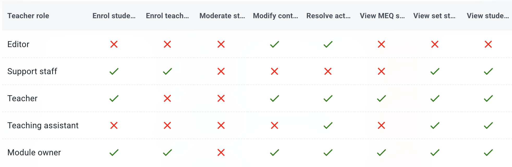

# Base User Roles

There are currently 3 base user roles:

## STUDENT

Users with the STUDENT role have access only to student pages. There is only one class or type of STUDENT role, however access to specific modules is subject to enrollment as a student on that module. Enrolment of students is done by a teacher.

## TEACHER

Users with the TEACHER role have access, in addition to student pages, to teacher pages. This includes, for example, the teacher home page (`/teacher`). Within TEACHER pages, users only have access to modules to which they are linked as a teacher or tutor. 

Access as a _teacher_ requires enrollment as a teacher on the relevant module, which can be done in two different ways:

- by teachers on that module with the relevant permissions.
- by ADMIN users in the ADMIN pages.

Access as a _tutor_ to teacher pages of a module is by a link to a student who is enrolled on that module. The link is via a ['global tag'](user_tags.md), which is managed by an ADMIN.

On each module that a user is enrolled as a teacher, they will be assigned a teacher _role_. The number of different roles (such as 'MODULE OWNER' or 'TEACHING ASSISTANT'), and their respective permissions, is configurable by ADMIN users. Each role is defined by which permissions are, or are not, assigned to the role. Permissions include access to pages, tabs, menus, and features (such as enrolling or viewing statistics).

Permissions that can be assigned to a teacher role are visible when enrolling a teacher. The pop-up shows which permissions exist, which roles have been configured, and their intersection. An example is below.

Permissions are part of the application. Roles are configured by ADMIN users on the app.

## ADMIN

Users with the ADMIN role have, in addtion to TEACHER and STUDET privileges, access to all admin pages. There is only one class of ADMIN.

# Teacher Roles

There are two fundamental TEACHER roles: OWNER and CUSTOM, with further configurations are possible through the CUSTOM role type, which are managed by ADMIN users. There is also a PERSONAL TUTOR role, which is an independent way to allocate permissions.

## OWNER

A fixed role. ADMIN can modify the role’s name, but cannot delete the role or change its permissions.

OWNER is assigned automatically to the user who creates a new module instance, but it may also be reassigned to other users with TEACHER (or ADMIN) base roles.

## CUSTOM

ADMINS can configure an unlimited number of custom roles, which can then be assigned to teachers by ADMIN, and by TEACHERs with relevant enrollment permissions on a given module.

## PERSONAL TUTOR

Tutor access is not a teacher role. It is a separate access mechanism derived from student–tutor relationships.

ADMIN cannot delete the tutor role but can modify its description and permissions, except for the `View student data` permission.

Tutors are implicitly assigned by linking a teacher to a Global (student) Tag. For example a Global Tag named '2028' could be applied to a cohort of students, and be linked to a teacher who is then a 'tutor'.

Tutor access to a module for a TEACHER (or ADMIN) requires at least one STUDENT in that module to share a Global Tag with the TEACHER (or ADMIN). Access to the module is then restricted by the permissions assigned to the PERSONAL TUTOR role.

Although the tutor role includes the `View student data` permission, that permission applies _only_ to students within the same tutor group (i.e. those sharing the same Global Tag); an exception is if the same user also has a TEACHER ROLE, on the same module, with `View student data` permission. Access to student data for tutors differs from normal TEACHER access, where permissions apply to all students within the module.

Note that a TEACHER can be enrolled on a module with a TEACHER role, and additionally by being linked as a TUTOR. Permissions then combine and are _additive_ (a permission from either role is sufficient for permission to be granted).

## Moderator access

Moderator features require a TEACHER role to include the `Moderate student submissions` permission. TEACHER roles with these permissions cannot be assigned by other TEACHERs (including OWNERs), but can only be assigned by an ADMIN.

Moderators have privileged access to staff-specific comments on MEQ, and this privilege is above that of a module owner. Details available in [../student/MEQ#access-to-meq-data](../../../student/MEQ/#access-to-meq-data).