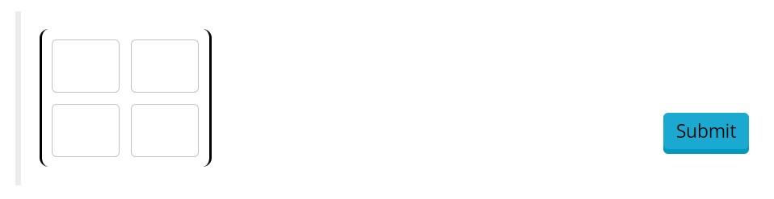

# Matrix

Matrix response area. Will populate the component with a grid of text input fields, in order to facilitate inputing matrices.

## Component Parameters 
### `shape` (required)
Required paramter, describes the shape of the Matrix to be displayed. This should be given as a length 2 array.

!!! example 

    ```json 
    "shape": [2, 2]
    ```

### `post_response_text` (optional)
Text block to be displayed to the left of the input field. Markdown and LaTeX are allowed following the usual syntax.

### `pre_response_text` (optional)
Text block to be displayed to the left of the input field. Markdown and LaTeX are allowed following the usual syntax.

## Response Structure
*This is how the react component will structure the user's input to the Grading Gateway, when they press the check button.* 

The user reponses are gathered into a nested list, and parsed using the JavaScript `parseFloat` function.

!!! example 

    ```json
    "response": [
      [123.0, 2.0],
      [8.0, 10.0]
    ]
    ```


## Example Screenshot 
