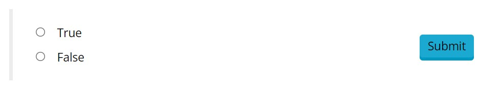

# TrueFalse

Simple True or False Response Area component. Shows two options "True" and "False" selectable by radio buttons.

## Component Parameters 
*none* 

## Response Structure
*This is how the react component will structure the user's input to the Grading Gateway, when they press the check button.* 

The response is an integer equal to `1` if the `true` option was selected, and `0` if the `false` option was selected.

!!! example

    ```json 
    "response": 1
    ```

## Example Screenshot 
