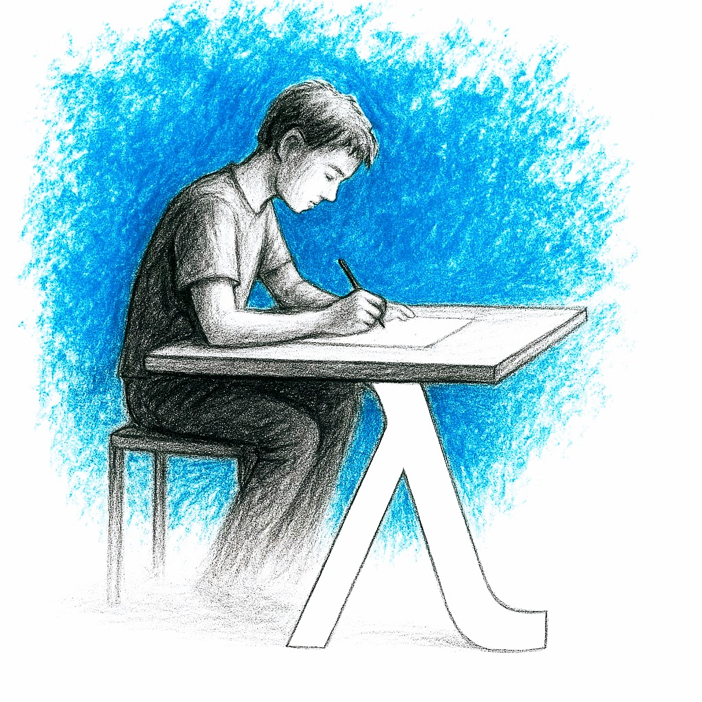
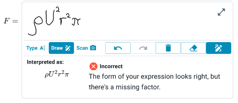

---
hide:
  - toc
---

# Welcome to Lambda Feedback!

A place to study, supported by automated feedback.

{width=350}

| **Students**:                                                                                                                                                                                                                                                                                  | **Teachers**:                                                                                                                                                                                                                                                                                  |
| ---------------------------------------------------------------------------------------------------------------------------------------------------------------------------------------------------------------------------------------------------------------------------------------------- | ---------------------------------------------------------------------------------------------------------------------------------------------------------------------------------------------------------------------------------------------------------------------------------------------- |
| <ul><li>Accessible content - in the browser and on PDF. </li><li>Feedback - express ideas naturally and get instant feedback, thousands of times per year. </li><li>Analytics - track your progress, manage your time.</li></ul> | <ul><li>Curate content - edit and publish your content in one place.</li><li>Feedback - configure automation to give students timely support.</li><li>Analytics - data driven feedback to students, and teaching organisation.</li></ul> |

 
Above: a screenshot from the web-app showing feedback on handwritten mathematics.

Lambda Feedback is a project at Imperial College running since 2021. For more info see our [list of publications](publications.md).

## Calling all teachers! 

We are recruiting participants to collaborate with us on a pilot. [Register your interest here.](https://forms.office.com/e/qA1UndSHrs)

## Overview of documentation:

In these docs you can find:

</li><li> [Student guide](student/index.md)
</li><li> [Teacher guide](teacher/index.md)
</li><li> [Advanced teachers](advanced/index.md).

Check out Lambda Feedback by clicking on the button below!

<figure markdown>
[Visit Lambda Feedback](https://lambdafeedback.com/){ .md-button .md-button--primary .center}
</figure>

