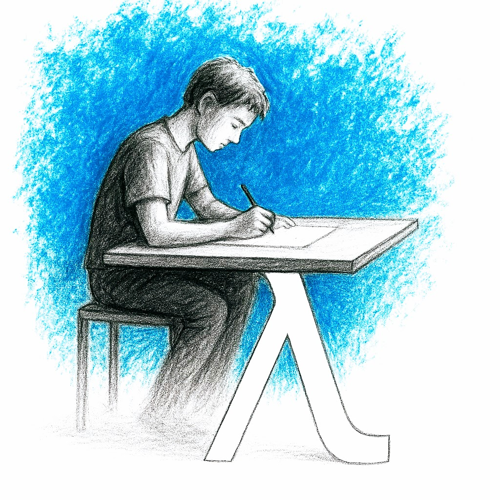
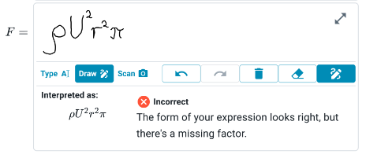

---
hide:
  - toc
---

# Lambda Feedback user documentation

Lambda Feedback: a place to study, supported by automated feedback.

{width=350}

 
Above: a screenshot from the web-app showing feedback on handwritten mathematics.

Lambda Feedback is a project at Imperial College running since 2021. For more info see:

- [list of publications](publications.md)
- [blog](https://blog.lambdafeedback.com)
- [platform](https://www.lambdafeedback.com)
- [code](github.com/lambda-feedback)
- [mu-Ed, a public standard API for education microservices - mued.org](https://mued.org)

## Overview of documentation:

In these docs you can find:

</li><li> [Student guide](student/index.md)
</li><li> [Teacher guide](teacher/index.md)
</li><li> [Advanced guide](advanced/index.md).

The advanced guide covers admin users, response area developers, and microservice developers.

<figure markdown>
[Open the Lambda Feedback platform](https://lambdafeedback.com/){ .md-button .md-button--primary .center}
</figure>

