# Major releases
This page contains summaries; see also [detailed releases](detailed_releases.md).

## 2026 Q2 new features

### Question locking

When a teacher opens a question for editing, it is now locked to prevent conflicts due to simultaneous edits by another teacher. Teachers see a clear indicator that the question is in use. 
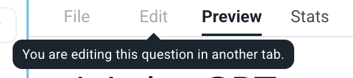
### µEd API 

Lambda Feedback now uses the µEd API to call evaluation functions and chat functions. The Microservices for Education API (µEd - see [mued.org](https://www.mued.org)) is a public, shared API definition. Platforms can seamless call or subsitute any compatible microservice (such as evaluation functions or chat bots), which can also serve multiple platforms. 

This collaboration betwen Imperial, TU Munich, ETH Zurich, and Nangyang Technology University (NTU), will lower barriers to innovation in automation for education, widen the impact of those innovations, and ensure that teachers are not locked-in to a limited set of automation services.

### Module-level function microservice availability

Admins can restrict which evaluation functions and chat functions are available within specific modules, rather than all functions being available everywhere.

## 2026 Q1 new features

### Images response area

Students can upload multiple image files for feedback. This innovation, by the EduVision team at Imperial, facilitates feedback on hands-on activities such as mechanical assemblies, lab work, or configuring physical spaces.

### Bulk enrol

Enrol or unenrol students and teachers across multiple module instances in a single flow. Supports enrolment by global tag or CSV upload, the latter with any combination of student and module. Therefore student enrolment for multiple modules and even cohorts can be completed in a single operation.

## 2025 Q4 new features

### Set layout and navigation

The question browsing experience has been redesigned:

- New two-pane adjustable layout — question content on one side, workspace on the other
- Students and teachers can navigate between questions within a set without returning to the set overview
- Teachers can reorder response areas by dragging

### Module Evaluation Questionnaires (MEQs)

A new category of Set for students to give feedback on a module:

- Any response area (including Likert-scale or free text)
- Feedback on the module and/or on nominated staff members
- Banner on student home page encourages responses
- Confidential responses. 

More info: 
- [https://docs.lambdafeedback.com/student/MEQ/](https://docs.lambdafeedback.com/student/MEQ/)
- [https://docs.lambdafeedback.com/teacher/guides/MEQ/](https://docs.lambdafeedback.com/teacher/guides/MEQ/)

## 2025 Q3 new features

### Handwriting input improvements

- Multi-line inputs, e.g. for proofs or full working
- Improved rendering and previews

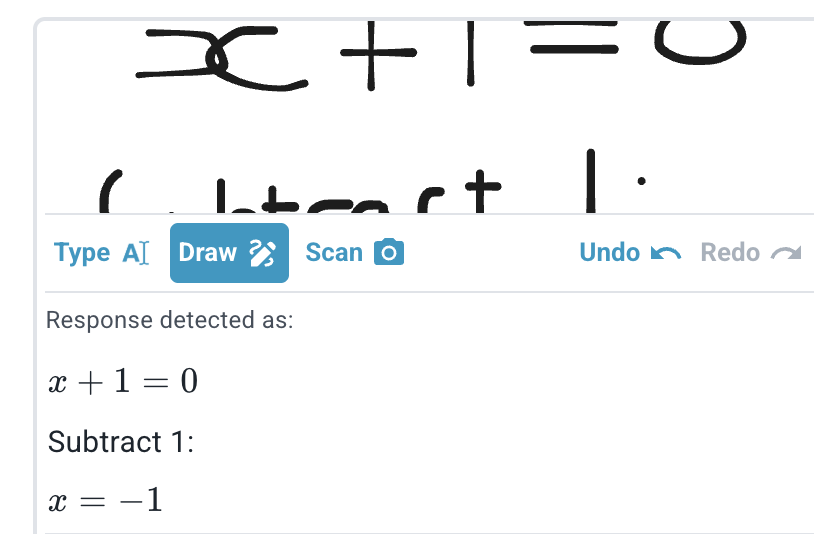

### Audio recording

In the content editor, record audio directly or drop in audio files. Students can play the audio clips.

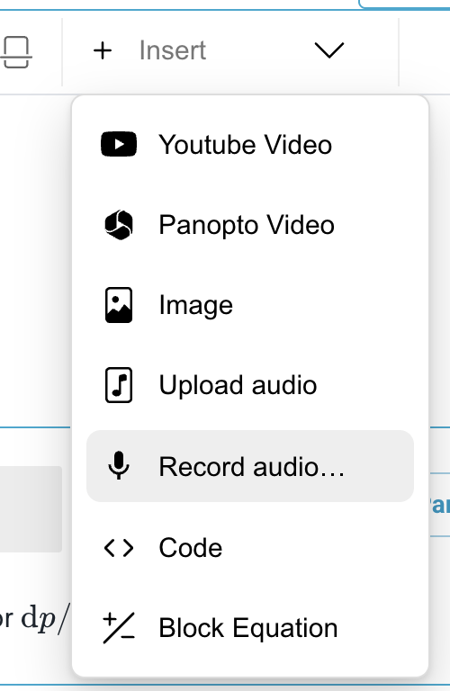
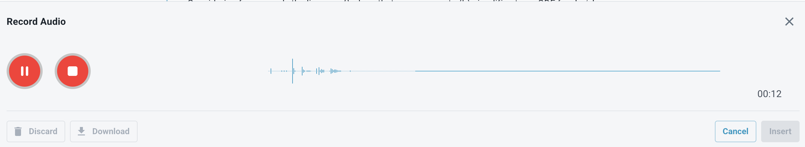

### Response area sandbox

A public sandbox repo for anyone to design their own response area, ready for integration into Lambda Feedback. More info: [https://github.com/lambda-feedback/response-area-sandbox](https://github.com/lambda-feedback/response-area-sandbox)

## 2025 Q2 new features

### User roles

- Access control: different Teacher roles have access to combinations of privileges, including content editing, user enrollment, viewing cohort data, and viewing student data. The screenshot below is an example, and more combinations can be created by admins:

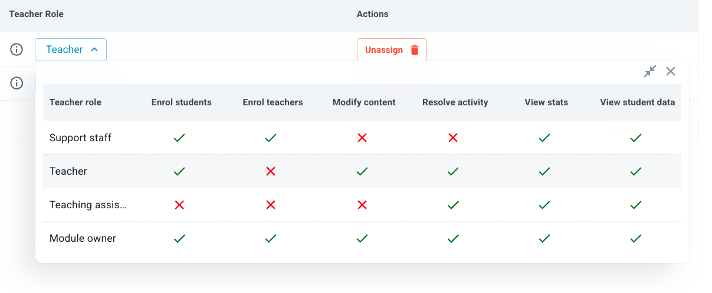

An example of the roles in action:

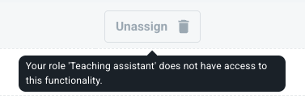

- Personal tutor role: 
	- This special role gives a specific teacher access to view data of a limited group of students.
	- Access is by 'Global tags' associating a student to a teacher (across all modules).
	- Teacher home page shows overview stats for personal tutees (see below).
	- Stats can be expanded and explored in more detail.
	- Data is symemtrically available to both students and tutors.

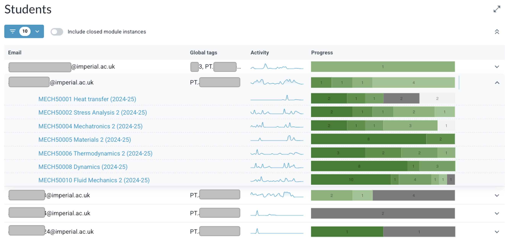

- Teachers - with relevant privilages - can now enrol other teachers, and change their roles.

## 2025 Q1 new features

### Data analytics

Enriched data for teachers, including:

- Completion statistics per response area (in the 'STATS' tab within a question)
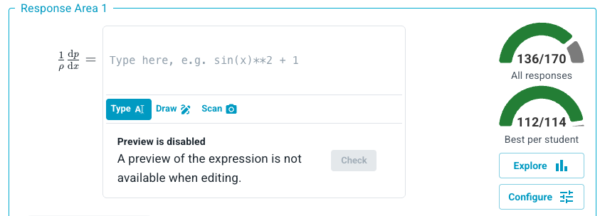
- Completion statistics per question (in the 'STATS' tab within a question) 
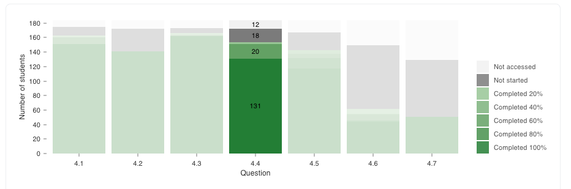
- Completion and activity statistics per Set (in the 'CONTENT' tab within a module) 
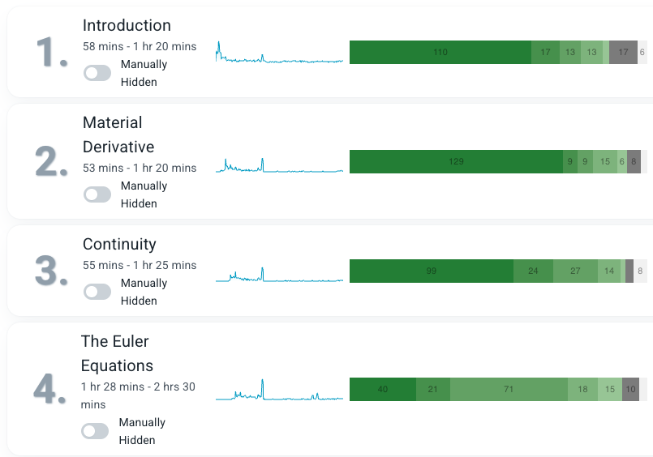
- Completion and activity statistics per Set (on the 'OVERVIEW' tab within a module) 
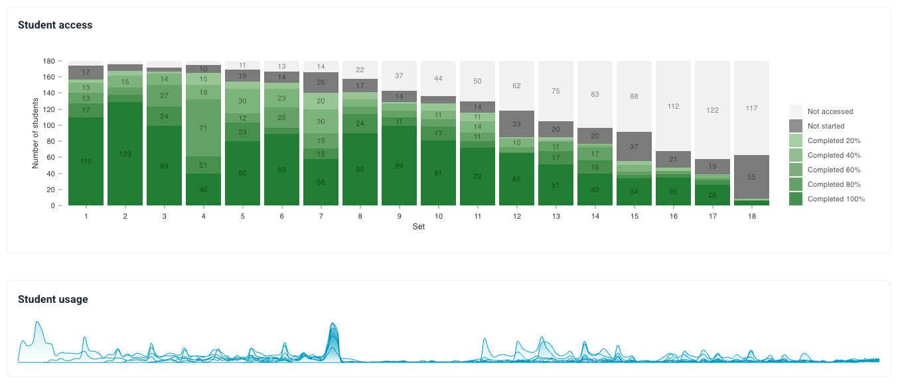
- Completion and activity statistics per Module (on the home page) 
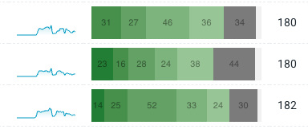

### Chat bots

The workspace has a 'chat' pane where users chat with a bot that has access to the question and the user's work on the question. 'Chat functions' will operate like evaluation functions --- they can be developed externally and plugged in. 
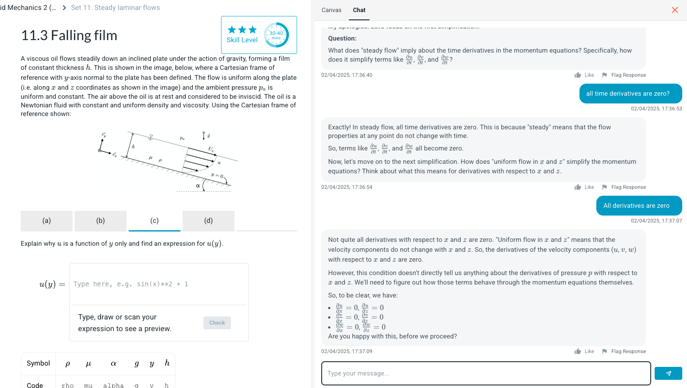

### New content editor 

'Lexdown', a markdown-first version of Meta's [lexical](https://lexical.dev/). As well as a more robust general component, this upgrade allows users to:

- Resize images
- Edit raw markdown
- Preview latex including when it doesn't compile (with errors in red) 
- Improved table capabilities

### User tags

- Tag users within a module ('module tag'), to allow grouping and filtering
- Tag users across modules ('global tag'), to allow user-orientated analytics (e.g. for pastoral care)

