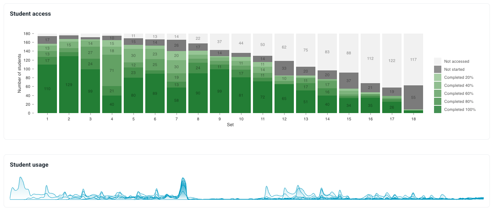

# Major releases
This page contains summaries; see also [detailed releases](detailed_releases.md).
## 2025 Q2 new features

### User roles

- Access control: different Teacher roles have access to combinations of privileges, including content editing, user enrollment, viewing cohort data, and viewing student data. The screenshot below is an example, and more combinations can be created by admins:

An example of the roles in action:

- Personal tutor role: 
	- This special role gives a specific teacher access to view data of a limited group of students.
	- Access is by 'Global tags' associating a student to a teacher (across all modules).
	- Teacher home page shows overview stats for personal tutees (see below).
	- Stats can be expanded and explored in more detail.
	- Data is symemtrically available to both students and tutors.

- Teachers - with relevant privilages - can now enrol other teachers, and change their roles.

## 2025 Q1 new features

### Data analytics

Enriched data for teachers, including:

- Completion statistics per response area (in the 'STATS' tab within a question)

- Completion statistics per question (in the 'STATS' tab within a question) 

- Completion and activity statistics per Set (in the 'CONTENT' tab within a module) 

- Completion and activity statistics per Set (on the 'OVERVIEW' tab within a module) 

- Completion and activity statistics per Module (on the home page) 

### Chat bots

The workspace has a 'chat' pane where users chat with a bot that has access to the question and the user's work on the question. 'Chat functions' will operate like evaluation functions --- they can be developed externally and plugged in. 

### New content editor 

'Lexdown', a markdown-first version of Meta's [lexical](https://lexical.dev/). As well as a more robust general component, this upgrade allows users to:

- Resize images
- Edit raw markdown
- Preview latex including when it doesn't compile (with errors in red) 
- Improved table capabilities

### User tags

- Tag users within a module ('module tag'), to allow grouping and filtering
- Tag users across modules ('global tag'), to allow user-orientated analytics (e.g. for pastoral care)

