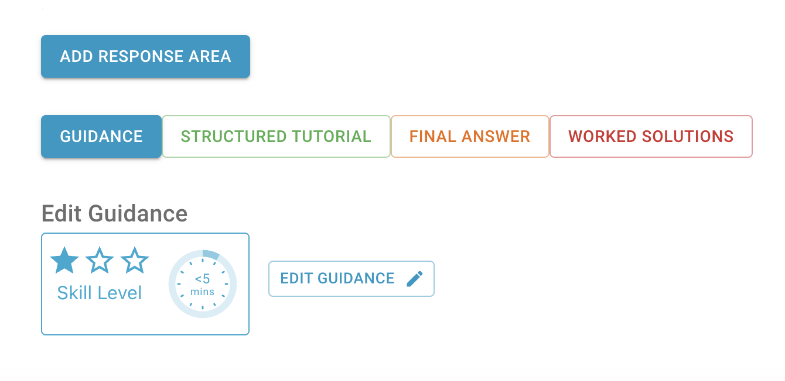
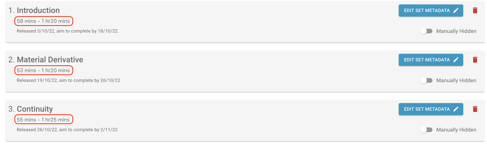
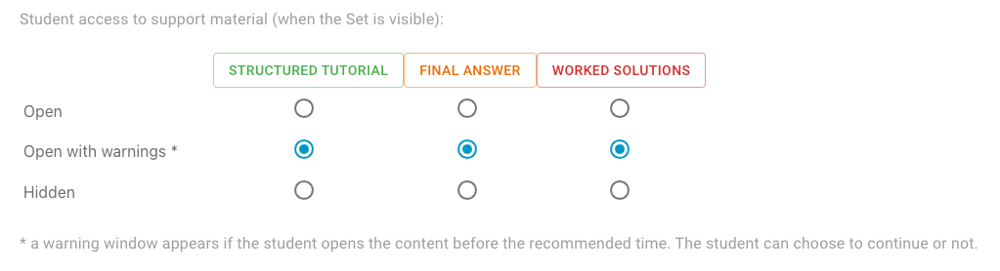
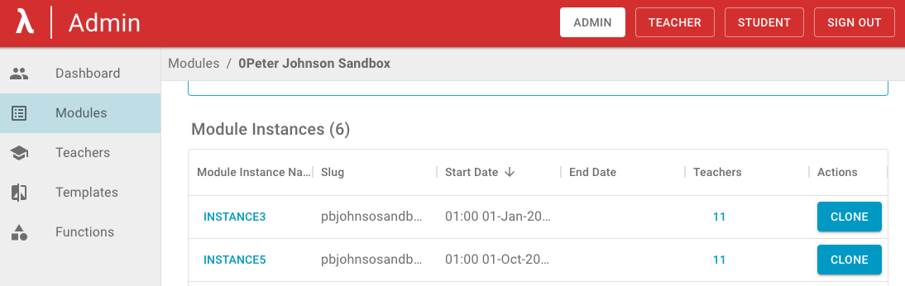
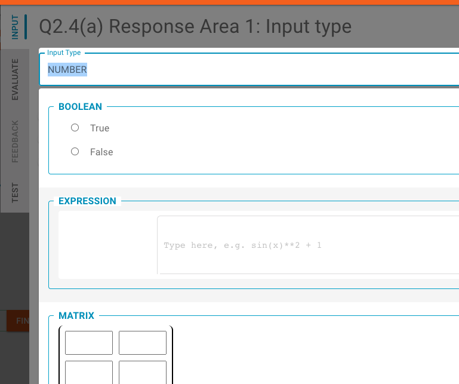
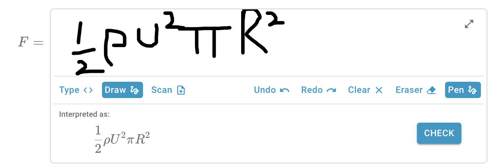

## Release 2024/09/27

- b457-option-to-omit-iscorrect-feedback - added the option for teachers to customise the feedback prefix and colour
- b459-image-on-the-same-line-as-preceding-text - corrected PDF generation to prevent images from appearing on the same line as the preceding text

## Release 2024/09/23

- b449-improve-mobile-navigation - improve mobile UI
- b462-final-summer-tweaks - ui improvements and fixes
- b146-follow-up - email notifications tweaks and fixes

## Release 2024/09/18

- b444-bulk-rollover-follow-up - updates to bulk rollover feature
- b452-ui-tweaks-ii - additional ui enhacements
- b453-config-panel-disabled-feedback-tab-is-still-accessible-by-next-and-previous-buttons - fixed an issue where disabled tabs in the response area configuration panel could still be accessed using navigation buttons

## Release 2024/09/14

-	b134-ipados-ios-safari-like-flag-problem-help-off-the-page - fixed scrolling of problem sets when using iPadOS or iOS Safari
-	b439-disable-download-when-no-pdf-available - improved behavior of the “Download set” drop-down button
- b407-all-questions-published-when-publishing-one - corrected version history page to display accurate data when viewing past question versions
- b434-ui-redesign-tweaks - additional tweaks to the user interface
- b442-bring-back-sets-download-options - restored “Set Download” drop-down button that was removed during the UI redesign
- b447-aws-db-backups-stopped - fixed the database backup issue
- b451-display-modules-even-if-sets-are-hidden - updated the system so students can view their modules, even if no sets are available
- b146-email-recap - add weekly email recap

## Release 2024/09/10

- b413-authentication-failures - code cleanup for updated authentication to avoid logging out (see b413 in [2024/08/23](#release-20240823))
- b438-enable-canvas-for-all-users - enabled canvas for all users (see b343 in [2024/06/28](#release-20240628))
- b441-custom-milkdown-theme-bug - adjusted the new Milkdown theme to improve compatibility with math mode

## Release 2024/09/04

- b441-revert-to-nord-theme - undo milkdown theme switch until math block is fixed

## Release 2024/09/03

- b386-provide-drop-down-list-for-ra-default-lambda-function

## Release 2024/09/02

- b398-upgrade-student-module-list - add new card view to module list student page
- b430-fix-redesign-bugs - add proper error handling to teacher pages when not a teacher
- b435-remove-env-from-git - remove .env file from git as it shouldn't be checked into vcs

## Release 2024/08/28

- b383-check-for-existing-module-name - Check if module name already exists when creating new module
- b383_do_not_query_without_module_id - do not run query from header without module id 
- b393-canvas-stored - Store canvas in database
- b425-studentmodule-and-studentmodules-api-retrieve-hidden-sets - do not retrieve hidden sets for students
- b427_display_pdf_errors_after_set_publish - Display PDF error message when publishing whole set
- b428-bulk-rollover-qa-comments - updates to bulk rollover feature
- b431-add-sentry - Add Sentry error monitoring
- b433-not-possible-to-enrol-students - fix to student enrollment
- b436-fix-instance-swapper - fix instance swapper

## Release 2024/08/23 - 2

- b380-fix-tables - Table paging fix
- b379-disappearing-r-at-beginning-of-line-milkdown - fix disappearing 'R' at beginning of line milkdown
- b413-force-renew - authentication update to avoid logging out
- b429_deleting_cases_and_tests_qa - ensure feedback case order is maintained
  
## Release 2024/08/23

- b413-grounded - updates to the authentication flow

## Release 2024/08/22 - 2

- b402-create-table-view - table view added to the teacher module view
- b406-prepare-ui-update - changes in the user interface

## Release 2024/08/22

- b356-delete-all-questions-in-set-not-handled-gracefully - create blank question when all others are deleted
- b409-module-bulk-rollover - bulk creation of new module instances (for admins)
- b417-set-part-to-a-when-switching-question - in teacher mode, when switching a question, always display part (a)
- b419-deleting-case-is-causing-feedbacks-to-shift-incorrectly - display correct remaining cases after deleting one
- b423-pdf-generation-displays-different-error-first-time - first PDF generation message consistent with follow up messages

## Release 2024/08/07

- b375-correct-tex-and-pdf-for-solutions - PDF generation improvements
- b412-export-import-wrong-order-of-parts - ensure correct part and response-area order when importing
- b413-authentication-failures - part 2 - prevent application logouts
- b416-download-set-as-json-downloads-wrong-set - ensure correct set when exporting JSON

## Release 2024/08/02

- b391-milkdown-fault-if-latex-on-last-line - fixed milkdown bug - if text ends with latex, it rendered raw but now renders properly.
- b415-guidance-time-suggestion-feature-by-colin - guidance time suggestion (using Machine Learning based on our database of content)

## Release 2024/07/26

- b369-guidance-text-on-enrollment - add a guidance text when adding students or teachers
- b381-not-possible-to-add-multiple-teachers - allow to add multiple teachers
- b410-open-doc-links-in-new-tab - open external links in a new tab
- b413-authentication-failures - fixed problems with application logouts

## Release 2024/07/24

- b378-admin-module-instance-breadcrumbs-incorrect - corrected the application header (for Admin module instance page)

## Release 2024/07/23

- b132 - security update for milkdown
- b366-non-imperial-users-to-be-able-to-log-in - non-Imperial logins enabled
- b374-admin-analytics-evaluation-functions - analytics for evaluation function errors
- b387-import-question-does-not-import-worked-solutions - corrected question export with solutions
- b388-tutorials-and-solutions-steps-messed-up - corrected sorting of solution branches

## Release 2024/07/18
- b392-essay-code-ras - add two new response area types: code and essay
- b396-better-feedback-box - improve the feedback box UI and accessibility

## Release 2024/07/16
- b395-vertical-text-align - remove excess margin from top part of question

## Release 2024/06/28

- b258-performance-analyse-db - faster response from DB queries
- b343-canvas - student canvas in beta mode (hidden by default)
- b351-teacher-module-page-ui-upgrades - Teacher module home page UI upgrades (tabs added)
- b357-upgrade-aws-sdk-v2-to-v3 - software library updates
- b359-generate-tex-file - upload/download whole Sets as LaTeX files

## Release 2024/06/14

- b305-export-whole-set - import/export whole sets
- b334-upgrade-node-next-nest - library updates

## Release 2024/05/29

- b352-support-to-eval-function-20-get-all-routes-by-getroutes - evaluation function deployment (check existing routes)
- b353-question-import-filter-out-unicode-characters - remove character (U-2006) on json import
- b354-double-confirm-on-confirmation-pop-ups - fix confirm button on modals in teacher mode

## Release 2024/05/24

- b97-remove-all-references-to-mongodb - remove code linking to legacy databases
- b243-add-question-id-to-the-url - add question identifier to the url
- b285-move-module-instance-drop-down-to-left-to-replace-the-instance-label - more user-friendly module instance selection
- b304-milkdown-element-in-admin-that-will-display-on-home-page - add an administrator page to configure a home page banner
- b330-modal-update - question version switch: allow teacher either to save or discard existing draft
- b349-support-to-eval-function-20-ensure-deployments - evaluation functions: production and non-production versions

## Release 2024/05/15

- b250-expression-ra-scan-mode-copy-and-paste - allow copy and paste and other improvements in the scan mode functionality
- b314-remove-experimental-from-ra-panel - "experimental" from the photo upload and handwritting labels removed
- b338-create-a-new-set-when-creating-a-module - a default set automatically creating when a new module is created
- b342-do-not-generate-pdf-when-creating-new-question - prevent PDF generation when a new question is added
- b345-after-pdf-generation-extraction-cleanup - a technical improvements into the PDF generation

## Release 2024/04/26

- b230-pdf-generation-in-a-separate-lambda-function - PDF generation is faster, more secure, and frees up bandwidth on the main server.
- b328-improve-expression-ui-in-tests - fix expression response area preview in tests tab
- b331-work-solutions-empty-content-not-handled-as-no-work-solutions - work solutions and structured tutorials buttons not to be displayed if the content is empty
- b339-accessible-response-area-feedback - displaying error returned by evaluation functions in a user-friendly format
- b340-remove-input-type-changed-warning-on-new-ra - do not display warning about response area type change for new response areas

## Release 2024/04/19

- 337-individual-tests-always-fail - fix individual reponse area test runs
- 327-consolidate-response-area-components - improvements for better response area consistency

## Release 2024/03/21

- b332-table-smart-resizing - resize table width based on the screen size

## Release 2024/03/19

- b286-ra-analytics-when-config-is-changed - Fix aggregates in stats
- b311-expression-area-layout-issues - Improve expression RA layout
- b325-populate-new-tests-with-the-answer - Populate new tests with the answer
- b322-enable-live-preview-in-teacher-mode - Attempt to enable live preview in teacher mode
- b35/b329-simplify-response-components - Simplificaton of Response Type components code

## Release 2024/03/13

- b84-legacy-content-db-tables - DB updates. No change to UX
- b315-include-answer-when-importing-case - ensure the answer value is included when importing a case from stats
- b320-response-type-allowlist - improves modular response areas
- b325-populate-new-tests-with-the-answer - prepopulate the answer by the correct answer when creating a new test
- b326-question-alignments - imroves alignments on the edit question page

## Release 2024/03/08

- b283-table-with-1-column-layout - improves table layout
- b324-show-required-error-on-number-input-wizard - improves number input validations

## Release 2024/03/05

- b301-redesign-part-response-areas-and-text-between-them - teachers can drag response areas while surrounding text stays in place, and merges where necessary.
- b35/b310-modular-response-areas-phase-6-cleanup - completes modular response areas. Code improvements and removing legacy tables.
- b323-delete-empty-answer-in-ra-panel - ensure delete works in answer box in response area panel

## Release 2024/03/04

- b319-survey-promotion-banner-on-home-page - add a banner onto the landing page advertising a survey with a link

## Release 2024/03/01

- b287-limit-access-to-sets-published-outside-of-current-date - ensure access to Sets follows release rules, including via URL
- b303-redirect-help-to-userdocs - redirect lambdafeedback.com/help to user documentation and lambdafeedback.com/[module slug] to the module page
- b318-url-for-survey - redirect lambdafeedback.com/survey

## Release 2024/02/29

- b35/b308-modular-response-areas-phase-4-custom-response-types - allow admin to dynamically create and manage new response types
- b35/b309-modular-response-areas-phase-5-migration - migrate all existing response types to the new modular type
- b313-always-display-post-ra-text-in-pdf-but-not-in-stats-mode - include all text in PDF (including after first response area)

## Release 2024/02/26

- b35-number-input-nan - fix handling of non-number input in the number answer wizard
- b317-no-header-refetch-on-mount - avoid unwanted refetch when resizing browser window on a set page
- b35/b307-modular-response-areas-phase-3-all-writes - start writting new and edited Response Area's Response to the new modular table
- b274-when-deleting-a-question-display-loading-message - display "loading" message when deleting a question

## Release 2024/02/20

- b290-the-final-answer-button-is-displayed-even-if-there-is-no-final-answer - fix: only display 'final answer' button when there is content to show
- b297-give-error-if-creating-module-with-same-name-as-deleted-module - improved formatting of error messages
- b299-legacy-content-db-tables-ra-contents - DB updates. No change to UX.
- b302-modal-warning-before-disabling-branching - warning modal when disabling branching in worked solutions and structured tutorials
- b35/b306-modular-response-areas-phase-2-new-modular-type - backend updates for modular response areas.

## Release 2024/02/15

- b35/b295-modular-response-areas-phase-1-switchless-frontend - a technical improvement to the response area building blocks in the code, so that it is easier, more intuitive and more straight forward to add new response areas

## Release 2024/02/13

- b271-unify-modals - unified modals to use same style
- b294-check-imports-from-material-ui - prevent importing whole library when importing an icon
- b300-delete-ra-add-warning-into-the-modal-that-the-text-below-the-ra-will-be-deleted-as-well - when deleting a response area (RA), warning modal that text below RA will also be deleted

## Release 2024/01/25

- b240-structured-tutorial-component-upgrade - converted structured tutorial to use the same structure and logic as worked solutions

## Release 2024/01/24

- b273-limit-access-to-unpublished-sets - ensure no student access to hidden sets via a url
- b277-milkdown-first-non-markdown-update-is-ignored - milkdown fix to for edge cases that were not saved (single character; deleting selection).
- b279-table-with-1-column - wider columns for table response areas with one column
- b280-change-response-colour-to-white - specifically for 'riskAssessment' evaluation function: display feedback for incorrect answer in white colour
- b281-tweaks-to-ra-analytics - tweaks to response area analytics

## Release 2024/01/16

- b272-legacy-db-tables-tutorial-sections - refactoring the database. No change to UX.

## Release 2024/01/10

- b264-untangle-changes - a technical improvement to make the milkdown wrapper code clearer.
- b247-re-generate-pdf-after-deleting-a-question - an improvement so that the PDF is automatically re-generated when a published question is deleted
- b158-change-prod-bucket-to-prod-not-staging - a technical change so that imported images and generated PDF files are saved in the correct AWS bucket dependently on the environment (production, staging or development)
- b232-ra-analytics-visual-alignment - a change to display response area analytics correctly aligned with labels
- b77-published-question-change-of-input-type - an improvement to allow changing of the input type on the response area that was already published.
- b262-legacy-content-db-tables-part-contents - refactoring the database. No change to UX.
- b245-question-numbering-is-sometimes-wrong-on-the-student-module-home-page - a correction so that question numbers are reconciled after a question is deleted
- b141-update-link-in-modal - a correction of the link from the modal (which appears when deleting a response area) to the user documentation
- b211-response-area-preview-remove-border - a change in the question preview in the teacher mode so that it is displayed in the same way as in the student mode
- b103-milkdown-slow-rendering - a technical change to speed up testing in local development environments

## Release 2023/12/15

- b103-milkdown-slow-rendering - developers can set a flag in local environment to speed up rendering pages with milkdown
- b235-content-with-hash-copied-across - prevent milkdown copying content with hash from one question to another
- b244-fix-notes-saving-in-the-student-mode - ensure student notes are visible including when switching from teacher to student mode
- b248-remove-unwanted-content-from-pdf - removed legacy response area pre-text and post-text from PDFs
- b251-post-a-reply-in-one-click - post a reply to a comment with one click
- b256-include-frequency-data-when-downloading-csv - correction to csv file generation for question stats, to include question numbers and frequency
- b260-number-and-unit-ra-do-not-align-with-pre-text-in-student-mode - align pre-text in the response area with number and units in student mode
- b261-master-content-sometimes-not-saved - ensure master content entered by the user is saved after publishing a question (not copied from the published version)

## Release 2023/12/08

- b246-rendering-of-list-of-sets-in-teacher-mode-takes-long-time - an improvement to render list of sets in teacher mode quicker
- b255-recover-lost-marked-parts - further corrections to DB. Some question parts were not marked correctly as DONE for questions imported from JSON between 13/10/23 and 5/12/24.

## Release 2023/12/05

- b242-mark-as-done-copied-across-questions - correction to DB submissions for questions imported from JSON between 13/10/23 and 5/12/24, which were linked together incorrectly.

## Release 2023/12/04

- b224-add-guidance-to-help - guidance on a question, already visible to users in a widget on top-right, is now also visible with the support material below the question
  
- b228-legacy-content-db-tables-master-content - refactoring the database. No change to UX.
- b109-expression-input-tweaks - tweaks to the few improvements in the expression response area (555 in [2023/05/26](#release-20230526)): icons, placeholder, upload size limit.
- b249-selected-question-index-lost - editor UX, improve the robustness of: when a question is added or published, ensure that question remains in focus to the user.
- b241-link-from-feed-needs-updating - corrected a URL linking from the teacher feed to a question.

## Release 2023/11/13

- b227-correct-set-estimates - time format improvement for displaying time estimate for each set in the list of set
- b233-publish-set-pdf-generation - an adjustment to the Publish whole set functionality to generate PDF after the confirmation button is clicked
  

## Release 2023/11/09

- b186-add-time-estimates-for-each-set-in-teacher-mode - added set estimates which is calculated as summary of estimates of all questions
- b204-input-symbols-empty-row-should-not-be-validated - an improvement to prevent validation of input symbols when a new row to enter input symbols is added
- b206-input-symbols-with-spaces - an improvement to remove potential spaces entered into the input symbol alternatives (the values must be seaparated by comma without spaces to make sure they work correctly)
- b226-update-question-split-prisma-transaction - extended Prisma timeout when a question is being saved or publish
- b225-bug-in-timed-release-for-pm-times - a change to display hours in 24 hour format when displaying time

## Release 2023/11/03

- b214-admin-dashboard-carry-on - admin dashboard improvements:
  - A drop down list to select the time period for the user access events graph
  - The last part of the graph lines are dotted to make clear that last values are subject to change

## Release 2023/11/01

- b207-pressing-enter-in-the-flag-textbox - an improvement so that when a user is using an expression response area and he attempts to submit a comment (or flag a problem) at the same time by clicking the enter, then only the comment (or the problem message) is submitted (and not the answer in the response area)
- b213-question-export-import-to-handle-mp3 - an improvement to allow to export and import questions containing an audio (or more audios)
- b217-remove-header-text-on-module-page-for-students - removed the header on the student module page as it is not needed
- b215-do-not-update-or-delete-notes-in-teacher-preview - an improvement to prevent submitting student solutions in the teacher preview mode
- b208-unposted-comments - an imrovement to handle the scenario when a user enters a comment and then, withouth submitting it, selects different question (the comment was copied to the newly selected question which is not a desired feature)
- b209-zero-comments-invite-comments - an improvement to open comments when there are no comments to invite users to comment

## Release 2023/10/20

- b202-ensure-eval-function-defaults-for-new-response-areas - an improvement so that evaluation function parameters are set to default values when creating a new response area
- b71-analytics-tweaks-teacher-view - the students list, view and contact pages were merged into a single page: - Filters by email and/or by access are available to filter the single list of students - A click on a student email opens a view which displays the same analytics the student can see
  
- b162-analytics-tweaks-stats-modal - improvements in the analytics view: - Colour is indicating the answer's case colour, if any, or the correct/incorrect default colour - Checkmark is indicating that the answer was correct - More options added to allow the user to agregate student answers
  
- b67-simplify-stats-interaction - few changes to response area statistics in the teacher mode:

  - The case is imported straight into the relevant response area
  - The response area menu has a new button EXPLORE so that the teacher can see the statistics per response area
    { width="400" }

- b192-reaction-count-one-hour-challenge - users can see the individual count of each type of reaction

  { width="300" }

- b183-activity-feed-make-clear-there-are-more-flags-than-5 - make clear to the user how many flags and comments there are in total as there might be more than 5 displayed on the teacher dashboard

  { width="400" }

- b110-import-multiple-jsons-from-a-single-zip - allows to import more questions from one zip file. This includes questions with attached pictures. Import of questions with attached audio files is yet to come.
- b205-admin-analytics-initial-work - first version of the admin dashboard is now provided. It includes information about number of current users, questions and user access events

## Release 2023/10/12

- b180-prod-freezing-and-restarting - increasing allocated memory to accommodate multiple users triggering heavy processes (PDF compilation)
- b193-implement-auto-scaling-on-infrastructure - Infrastructure upgrades for larger scale usage.
- b124-question-export-with-pictures-fails-sometimes-on-cors-error - forcing Chrome to refresh media retriaval from S3 bucket to make sure correct headers are attached to the response
- b199-migration-script-for-physics-expression-ra - DB migration for legacy content.
- b194-create-set-and-first-question-improvement - new set automatically has a blank question ready.
- b197-not-possible-to-delete-a-question - increase timeout when deleting a question
- b143-more-info-in-modal-when-publish-whole-set - displaying list of questions that will be published in a modal before publishing whole set.
- b144-modal-to-check-before-removing-branches - a warning message is displayed before a branch from worked solutions is deleted

## Release 2023/10/05

- b136-change-to-breadcrumbs - an improvement to remove module instances from teachers and students breadcrumbs as they do not link to any pages
- b188-add-information-when-rendering-a-new-question - adding information that a question is being created when adding a new question
- b189-failed-fetching-your-problem-set-message-appearing-when-it-should-not - a warning message 'Failed fetching your problem set' is to be displayed only if there is an error

## Release 2023/10/03

- b191-expression-response-area-defaults - an improvement so that when creating a new response area of type EXPRESSION, the default values are set to:
  - TRUE for Live preview
  - FALSE for Display input symbols
  - FALSE for Include in PDF
  - TRUE for Enable handwriting input
  - TRUE for Enable photo upload
- b187-support-materials-access-enhancements - enhancements to the support materals student access configuration:
  - A new button event was added to record whether students proceeded or cancelled after a warning message appeared when a student tried to open a support material
  - Labels were renamed to make their meaning clearer (e.g. 'Open' was changed to 'Available' and 'Hidden' to 'Unavailable')
  - When a question part is marked as done, then no warning is displayed to a student when opening a support material (even if marked as Open with warnings)

## Release 2023/09/29

- b148-problem-adding-new-question-after-changing-name-of-current-question - an improvement so that a user cannot start changing newly added question (e.g. changing name) until all processes are finished and therefore preventing these changes to be wiped out.
- b161-renaming-question-straight-after-making-it - this is the same problem as b148
- b151-quote-marks-can-break-flags - an improvement so that double-quote marks, if used in a text, are displayed correctly in the generated csv file
- b164-grade-param-type-changed-reverts-to-string-when-value-is-empty - an improvment to identify a number as a number in the grade parameters, so that the type is displayed number and not as string
- b166-no-template-questions-in-the-list - an improvement to display all existing template questions in the list (when adding a new question from a template)
- b190-draw-area-width-keeps-changing - an improvement to stop the drawing area changing its width when a warning message is displayed that the writting cannot be interpreted

## Release 2023/09/27

- b157-new-eval-function-reset-parameters - improvement in the response area panel, when the evaluation function is changed, then the default evaluation function parameters are re-set.
- b167-teachers-are-sent-to-the-most-recent-instance-on-the-module-homepage-even-when-they-dont-have-access-they-should-be-sent-to-the-most-recent-one-that-they-have-access-to
- b163-failed-fetching-your-problem-set-displayed-on-every-page-load - an improvement so that the warning message only appears when the fetch returns an error.
- b149-restrict-access-to-worked-solutions - restrict student access to support materials on set level and on question level.
  
- b165-preview-not-the-same-as-student-view - an improvement to displaye pre-text, value and post-text aligned horizontally in the response area student view

## Release 2023/09/08

- 128-feedback-area-does-not-support-latex-rendering - Feedbacks returned by the evaluation function are displayed using latex editor.

## Release 2023/09/07

- b155-aws-ending-support-for-nodejs-14-in-aws-lambda - A clear-up of an outdated library.
- b153-pressing-enter-in-a-number-response-adds-new-line-to-the-response - Handle Enter in the response area as a submission of the answer.
- b139-archive-feature-enhancements - Enancements of module as module instance archiving.
- b68-cleaning-up-the-editor - many ui enhancements in the question editing page
- b115-case-color-under-feedback-tab-for-response-area-is-not-functional - The custom colour for feedbacks is now displayed correctly.

## Release 2023/08/30

- b33-audio-clips - in the content editor, drag-and-drop an audio file, and it will add a sound (e.g. narration) to the content.
- b145-xetex-pdf - PDFs are now compiled with xelatex, not PDFlatex.
- b150-extracting-code-from-listener-into-callback-fn - stats for typed expressions now record full submissions only (not keystrokes)

## Release 2023/08/22

- b147-time-guidance-is-currently-very-small - An adjustment after upgrading one of the libraries which caused the time guidance to shrink.
- b142-module-clone-enhancements - An enhancemnt to include links to already generated PDF files for all sets in the cloned module instance.
- b138-503-error - An enhancement to navigate to the teacher module / module instance after clicking Cancel button in the Set Metadata page.

## Release 2023/08/18

- b114-matrix-input-centering-in-teacher-mode-but-not-in-student-mode - The Check button for matrix questions in the response area panel is now vertically centred in the student view.
- b140-response-area-pre-text-doubled - The legacy response area pre-text was removed from the student view.

## Release 2023/08/16

- b127-cloned-instances-are-missing-tutorials-and-worked-solutions - An enhancement of the module cloning functionality to include worked solutions and tutorials.
- b125-when-publishing-question-update-the-student-view - An enhacement so that when a teacher publishes a question then, this question is visible in the student view without having to refresh the browser or log out and back in again.
- b83-revisit-set-archiving - This is a technical improvement of the existing functionality to archive sets so that it is done in the same way as archiving of other entities. It has no visible any impacts to a user.
- b111-archive-module-instance-option - A new feature to allow to archive a module instance. This feature is only available to an administrator.
- b126-archive-module-option - A new feature to allow to archive a module. This feature is only available to an administrator.
- b108-error-when-clicking-add-question-button-while-inside-part-content-box - Technical improvement. Upgrade of some libraries (Material UI) to prevent errors caused by issues in the older library version.

## Release 2023/07/21

- b101-tests-run-from-the-configure-panel-have-the-islatex-parameter-set-to-true - A correction to the settings on the new _Expression_ input (see 555 in [2023/05/26](#release-20230526)). When calling an evaluation function, the `is_latex` parameter dependends on the type of input (type/draw/scan).
- b120-PDF-skill-time-info - PDFs now include information on skill level, time estimates, and guidance below the question title and above the question content.
- b122-multi-year-carry-on - extended UI features referring to module instances (see b82 below).

## Release 2023/07/19

- b82-multi-year-duplicate-module-instance-and-link-entities - new feature to clone module instances
  
- b118-multi-year-tidy-up - multi module feature enhancements such as sorting and filtering module instances on the admin Module page

## Release 2023/07/14

- b72-multi-year-module-instances-introduction - All Modules now exist as an 'Instance' of a Module, in preparation for allowing multiple Instances. The UI navigation is updated to handle Module Instances.
- b81-show-preview-of-ra-in-input-type-select - Selecting an Input Type for a Response Area: a searchable preview of Input Types improves the UX: users see the preview while selecting.
  
- b91-prevent-multiple-blank-questions - When a question is added, the 'add quesiton' button is temporarily disabled while the application updates.
- b112-bug-the-tab-navigation-bar-at-the-top-disappears - Editor tabs are pesistent including during keyboard navigation
- b116-pdf-display-between-ras - PDF generation: for multiple Response Areas in a Part, the order is now always correct

## Release 2023/06/22

- b39-new-editor-menus - question editor area menus have been converted into tabs. Other improvements have also been made to the editor layout inlcuding switching between teacher and student mode and staying on the same question. 
- b62-add-tabs-to-reponse-area-panel - the Response Area panel is grouped into tabs that aid navigation and encourage a workflow that matches the way teachers think. Other layout improvements were also made within the tabs. 
- b79-input-type-on-published-ra-should-not-be-editable - input type cannot be changed after publishing (see 598 here [2023/06/05](#release-20230605)).
- b85-incorrect-required-error-message - enhanced validation for number 0 in numeric response area.
- 588-question-import-export-handle-images - import export includes images; a zip file is used to combine the JSON and the images.
- 601-parameter-defaults-for-an-eval-function-cpq - improved the appearance of boolean evaluation function parameters.
- 603-user-docs-updates - user documentation repo renamed from "documentation" to "user_documentation".
- 608-link-word-sign-in-to-sign-in-on-homepage - on the home page 'sign in' text is now a link to sign in.
- 619-mcq-check-button-should-be-vertically-central - the Check button for multi-choice questions in the response area panel is now vertically centred.

## Release 2023/06/05

- 598-published-questions-change-of-approach - questions are now fully editable after publishing. All data from student responses persists through these changes. One exception is that the input type of a response area cannot be changed after publication, because this would change the format of the data that is recorded (you can, however, delete the response area and create a new one instead). Other new features: duplicate a Response Area; reorder Response Areas using drag and drop (in a similar way as reordering Parts).
- 613-enable-publish-whole-set - see 606 below ([2023/05/26](#release-20230526)). The 'Publish Whole Set' button is now enabled.
- 614-error-with-stats-on-dev - ensures statistics still work with the new handwriting input (see 555 below).

## Release 2023/05/26

- 555-handwriting-response-area-upgrades - A new version of the _Expression_ input type is in use. Input by handwriting onscreen or with scanned images is an option for teachers to make available to students (default: off). Also, regardless of the input mode (type/draw/scan) the live preview now gives 'pre-submission' feedback on whether the response can be interpreted, and the Check button is only available if interpretation is successful.
- 606-publish-whole-set-causing-stats-to-disappear - The 'Publish Whole Set' button in Teacher Edit mode has been disabled because it was causing data to become unlikned in the DB, giving the effect of data like number of completed parts 'disappearing'. Existing data has now been relinked and is all visible to users. The feature that caused the problem has been disabled while we prepare a replacement to be pushed shortly.
- 612-whole-part-marked-as-done-with-more-response-areas - Student functionality. If a question part has multiple Response Areas, the logic is now that only if all Response Areas are correctly answered will the 'Mark as done' feature be automatically checked. Previously only one correct answer was required to trigger this effect.
- 585-question-simple-import-and-export - Teacher functionality. The import/export functionality has been enhanced so that it Response Area parameters, cases, and tests are now all included.

## Release 2023/03/21

- 571-simple-teacher-comment-feed - Teacher functionality. New 'Activity feed' (formerly 'Flagged Questions') contains flagged questions and comments. The teacher can filter the table to see e.g. only flags or only comments. The teacher can also sort the table e.g. to see the new activities first.
- 569-numeric-input-strips-out-strings-that-may-have-meaning - Technical dept. For the Response Area input type 'Number', additional validation added; if the input contains a non-numeric value then a relevant error message is displayed to the user (this is linked to the 573-response-area-validation-specific-errors below).
- 573-response-area-validation-specific-errors - Teacher and student functionality. More specific error messages are displayed when the user inserts a value in an incorrect format (e.g. a non-numeric value into the input that expects a number).
- 582-empty-structured-tutorial-shouldnt-display - Technical debt. When a tutorial is deleted, it is not displayed at all to students (as opposed to being blank).
- 585-question-simple-import-and-export - Teacher functionality. Export a question to a file in JSON format. Import a question from a file in JSON format. Images are not imported/exported - these need to be handled manually until a new feature is ready. This feature opens the door to file imports if content can be converted into the correct format.
- 586-question-import-add-schema-validation - Teacher functionality. When importing a question from a file, the data structure and format is validated. If the validation fails then relevant error messages displayed to the user.

## Release 2023/03/06

- 566-pdf-error-identification - Teacher functionality. When a PDF fails to compile, the location of the error source is given in more detail, e.g. 'Q2(c)'.
- 576-orderedsetids-throws-error-in-main - Technical. When loading sets in a module on the teacher side, an error no longer appears in the console.
- 522-adding-teacher-when-creating-module-inadequate-error-message - Admin functionality. When adding a new module, a teacher can be added simultaneously. If the proposed teacher is not already registered as a teacher, then they are now automatically created as a teacher and a confirmation message is displayed.
- 524-remove-teacher-from-list - Admin functionality. Remove a teacher from the list of teachers. If the teacher is still a teacher on a module, then display a modal confirming which modules the teacher will be removed from. If the user confirms, the teacher is removed from all the modules and then they are deleted from the list of teachers.
- 572-comment-upvote-tweeks - Teacher and Student functionality. Right margin on the comments tweaked so that the sorting feature and 'post' button are not too far away from each other.
- 483-show-all-button - Teacher functionality. The Show All feature is now enabled in the question preview mode.
- 520-default-to-an-eval-function-after-selecting-the-response-area - Teacher functionality. In the Response area edit panel, automatically select a default eval function as follows (it can be edited by the teacher if necessary). The default selections are:

      | Response area       | Default evaluation function |
      | ------------------- | --------------------------- |
      | MCQ                 | arrayEqual                  |
      | NUMERIC             | isSimilar                   |
      | Expression and Text | symbolicEqual               |
      | Table and Matrix    | arraySymbolicEqual          |
      | NUMERIC_UNITS       | comparePhysicalQuantities   |

## Release 2023/02/10

- 560-comment-feature-tweaks - UI improvements to the comments feature.
- 550-comment-upvotes - users can upvote comments by clicking on the heart. Sorting by upvotes is default
- 546-always-test-a-response-area-when-saving - [For teachers only] this is an invisible feature that automatically tests a response area, when closing the editing panel, to check that the correct answer is accepted as correct. A failure to pass this test will show an error and not save the response area until fixed. The reason for this feature is to catch things like empty cells in the teacher answer which, e.g. for a matrix, would make marking student answers impossible. If such errors were allowed to pass, then students would experience errors when using the response area - hence it cannot be allowed. The auto-test feature is not enabled for all response areas as some are not compatible - the option can be enabled/disabled for each response area by admins.
- 568-numeric-input-expects-string - upgrade to the numeric input type when dealing with string inputs.
