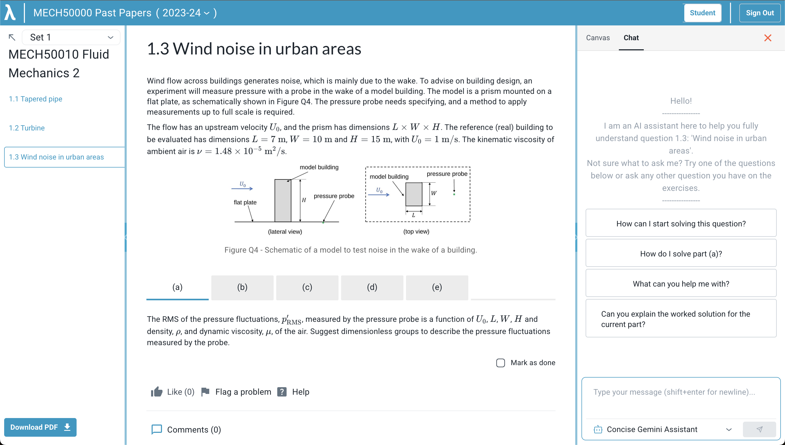

# Get started as a student using Lambda Feedback

## Accessing content

### Log in
Use your Imperial Microsoft account to sign in and access your modules. Once you sign in, you should see a list of the modules you are enrolled in:
 
 You can see the current progress of each module in this view.
  

  
### Select a module
Click on the module name to select it. You should now see a list of available problem sets. If none are available, your teacher may not have assigned any yet.

You can see the current progress of each problem set in this view.
  

  
### Select a problem set
Select the problem set you wish to work on, and you should see a list of questions on the left-hand side, with the selected question on the right. If a question has sub-parts, you can select them on the right.

  
### Accessing the PDF version of a problem set
If you prefer to work on a PDF version of the problem set, you can generate a PDF by clicking the 'pdf' button underneath the problem set title.
  

  
### Answering questions
You can make progress on the problem by entering correct answers or clicking the **'Mark as done'** button on the bottom right of each question page. This can be useful to track progress if working on the PDF version, or for questions which do not have a response box, e.g., show that questions.

See the [Answering Questions](answering_questions.md) page for more help with answering questions.

### Using the Workspace

The Workspace provides you with various functionalities to assist you during your learning process:
#### 1. Canvas: 
A pane where you can write down your thought process and notes for the previewed question (handwriting, sticky notes & text).

#### 2. Chat: 
A chat interface connecting you with helpful AI Chatbots to discuss any questions you have on the current topic you are working on.

Your edits and progress in the Workspace are saved per each Question you preview. So, you will be able to view your old edits for the Question you are currently on.
