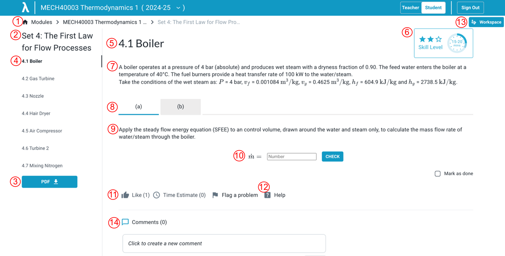

# Student/User Documentation
---

## Question structure

{: style="width:600px"}

The image above shows an example question, with numbers to indicate:

1. Breadcrumbs showing location
2. Name of the Problem Set
3. PDF version (link)
4. Names of the questions in the Set, indicating which question is open
5. Question number and name
6. Guidance (expands on hover)
7. _Master content_ (always visible to student)
8. Part selection (tabs)
9. _Part content_ (only visible when relevant part is open - (a),(b), etc.)
10. _Response area_, where student responses are entered and feedback is given
11. Feedback to the teacher (currently in flux regarding the design - 02/07/25)
12. Access to content 'below the line' providing extra support.
13. _Workspace_ - Opens tab with canvas and ai chatbot
14. Comments

## Below the line

{: style="height:50px"}

- _Structured tutorial_ - teachers use this in different ways. It is generally a way to provide scaffolding if you're struggling.
- _Final Answer_ - warning, don't ever look at the answer before you make your own genuine attempt at answering the question.
- _Worked solutions_ - warning, don't ever look at the solutions before you make your own attempt. If necessary, look at the first line and reveal a step at a time.
