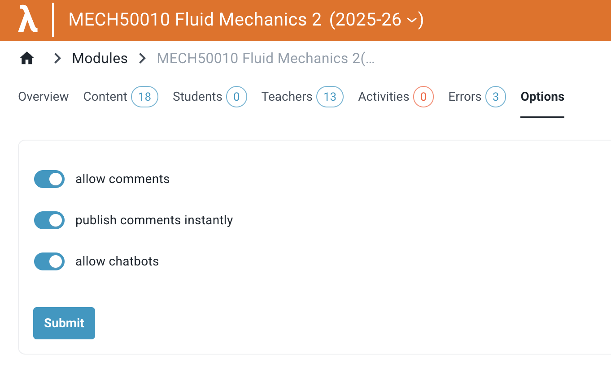
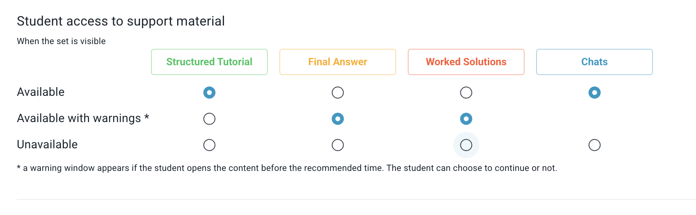
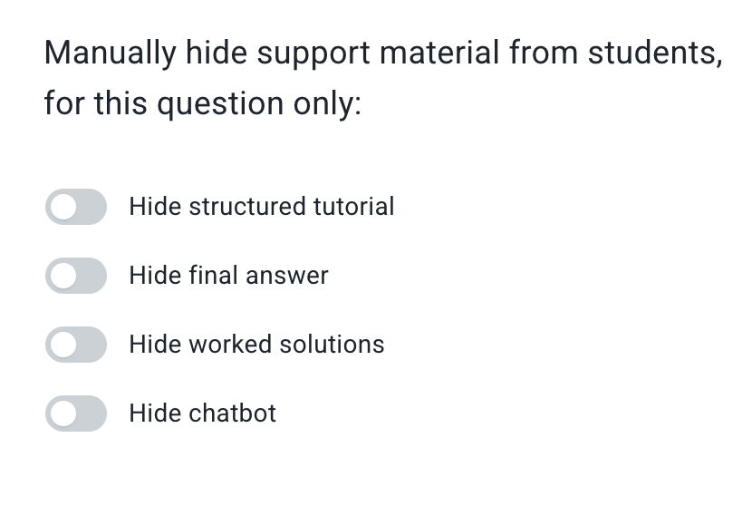

# Chatbots

Lambda Feedback offers integrated chatbots that students can open from the workspace tab to get help while working on a question. 

For an overview of the chatbots currently available and the context each one is given about the student and question, see the [student page](../../student/chatbots.md).

For technical details behind each chatbot, see [Chat functions - More information](../../advanced/chat_functions/info.md).

## Enabling chatbots

To make chatbots available to your students, turn them on within the module settings. You can also hide chatbots from students on specific sets and questions by toggling the "Show chatbots" setting at that level.

| Module level | Set level | Question level |
|---|---|---|
|  |  |  |

## Want a specific chatbot?

If none of the available chatbots fit your needs, you can build your own — see the [Chat function quickstart](../../advanced/chat_functions/quickstart.md).
