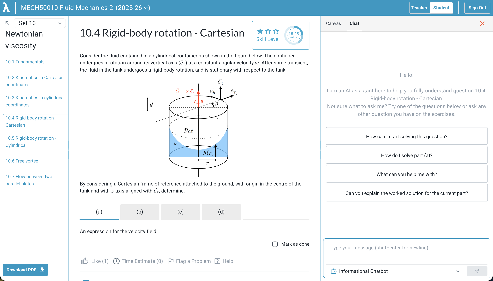

# Chatbots

Lambda Feedback offers integrated chatbots that students can open from the workspace tab to get help while working on a question. 

The chatbots's goal is to assist students while they are working on a question. The student can discuss with the chatbot any aspect of the question, their progress, or the feedback they have received so far. The chatbot will use the information it has about the question and the student's progress to provide relevant help.
The chatbots differ mainly in their helping behaviour — from giving a full explanation on request, through nudging with hints, to pushing the student to reflect with follow-up questions.

Every chatbot is automatically given:

- The full question content, parts, final answer, worked solution, and your guidance blurb
- The set name, number, and description
- The student's response history for each response area (total submissions, wrong submissions, latest submission and feedback)
- Time the student has spent on the question and current part today
- The chat history with that student

> If you would like to make the chatbots available to your students, you can turn them on within the module settings. You can also choose to hide the chatbots from students on specific sets and questions by toggling the "Show chatbots" setting for that question or set.

> | Module level | Set level | Question level |
>  |---|---|---|
>  |  |  |  |

## Comparison

| Chatbot | Best for | Tone | LLM | ~Response time |
|---|---|---|---|---|
| [Informational](#informational) | Students who want explanations and worked-through help | Explanatory | Gemini 2.5 Flash Lite (Google) | ~10s |
| [Concise](#concise) | Students who want a quick hint and to get back to working | Short | Gemini 2.5 Flash Lite (Google) | ~10s |
| [Reflective](#reflective) | Students who want to be encouraged to think through problems themselves | Socratic | gpt-4o-mini (OpenAI) | ~10s |

---

## Informational

**Role:** A patient AI tutor focused on student-centred learning - aims to foster critical thinking, active engagement, and confidence-building.

**Key behaviours from the role prompt**

- **Step-by-step guidance:** breaks problems into smaller steps and offers hints or intermediate steps before giving the final answer. Will share the complete answer if the student explicitly asks, but only after first encouraging exploration.
- **Error reflection:** treats mistakes as opportunities — helps the student work out *why* something went wrong rather than silently correcting it.
- **Awareness of materials:** grounds responses in the question's content, answer, worked solution, and your guidance — paraphrasing rather than quoting verbatim.
- **Adaptive support:** if the student keeps struggling, evaluates their progress and time spent on the question and gradually offers more detailed and specific guidance.
- **Engagement:** ends interactions with a question to keep the dialogue going and gauge comprehension. 
- **Praise** is reserved for genuine effort or breakthroughs to avoid sounding insincere.
- **Stays on topic:** politely redirects students who ask about unrelated material.

**Example chat**

> **Student:** How can I start solving this question?
>
> **Informational:** The question asks which of the given sets of equations represent possible three-dimensional incompressible flow cases. To determine this, we need to check the condition for incompressible flow for each case.
>
> Do you recall the mathematical condition for a flow to be incompressible?

[More details and source →](https://github.com/lambda-feedback/informationalChatFunction/blob/main/docs/user.md)

---

## Concise

**Role:** A tutor that gives short, direct answers.

**Key behaviours from the role prompt**

- **Direct and minimal:** answers the question and stops — no extra details, explanations, or examples unless the student asks.
- **Aware of struggle:** if the student seems stuck or frustrated, references their progress so far and how long they've spent on the question relative to your guidance time.
- **Stays on topic:** redirects unrelated questions back to the current material with a short refusal.
- **No filler:** does not end messages with concluding statements or summaries.

**Example chat**

> **Student:** How can I start solving this question?
>
> **Concise:** Consider which governing equation applies to this problem.

[More details and source →](https://github.com/lambda-feedback/conciseChatFunction/blob/main/docs/user.md)

---

## Reflective

**Role:** A Socratic tutor that guides students to discover knowledge through questioning rather than direct instruction.

**Key behaviours from the role prompt**

- **Always ends with a question:** every response finishes with a follow-up question that pushes the student's thinking forward.
- **Counter-questions over answers:** when a student asks a direct question, responds with a question that guides them toward the answer rather than handing it over. If it does share a fact, it immediately follows with a question that asks the student to apply or extend it.
- **Uses a varied question toolkit:** clarifying ("What do you mean by…?"), assumption-probing ("What are you assuming here?"), evidence-based, perspective, implication, and meta-questions about why a question matters.
- **Diagnoses where the student is stuck:** if a student is frustrated, asks about their thought process to locate the gap, drawing on their progress and time spent.
- **Never provides complete answers:** always leaves room for the student to think and respond.

**Example chat**

> **Student:** How can I start solving this question?
>
> **Reflective:** What specific part of the question are you looking to tackle first, and what do you already understand about the concepts involved, such as the flow characteristics in a viscometer?

[More details and source →](https://github.com/lambda-feedback/reflectiveChatFunction/blob/main/docs/user.md)

---

## Want a different chatbot?

If none of these fit, you can build your own — see the [Chat function quickstart](../../advanced/chat_functions/quickstart.md).
