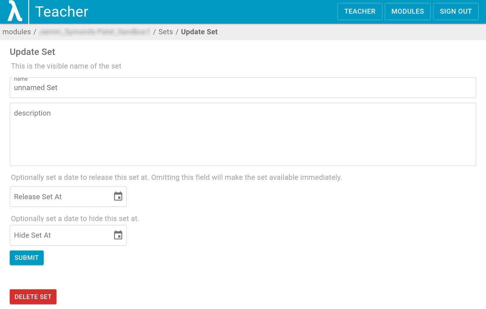

# Content Creation - Sets and Questions
In this guide, we will walk through how to create [sets](https://lambda-feedback.github.io/Documentation/intro/terminology/#sets) and [questions](https://lambda-feedback.github.io/Documentation/intro/terminology/#questions).

## Creating Sets
1. Upon first logging in to Lambda Feedback, we are met with a list of all of our modules. This gives us access to our modules as if we were a student, however, we want access to the modules which we ourselves have created as teachers. Thus, we must switch to the "Teacher" panel.

    

2. Once we are in the "Teacher" panel, we can select the module we wish to edit.

    

3. We then enter the module's panel. Here, we can access the list of students and teachers who have access to that module. We may also see some statistics for the module below the three main buttons, showing how many have accessed the sets within that module. But what we are interested in are the sets, and so we would select the "VIEW SETS" button.

    

4. We then are presented with all the sets within the module we selected. If this is a new module, then there will be no sets. In order to create a set, we want to click on the "CREATE SET" button.

    

5. If we create a new set, it will appear within our list of sets as an unnamed set. The first thing we want to do is to edit the name of our set by clicking on the "EDIT SET METADATA" button. Furthermore, we are able to hide it from the view of students by toggling it to be "Manually Hidden", and delete it with the bin icon.

    

6. The metadata which we can edit consists of the name of the set, a description, a release date, and a hide date.

    

7. Once done editing, hit the "SUBMIT" button. We are then taken back to the list of our sets, but with our changes made.

    

To create more sets, we just need to repeat this process.
