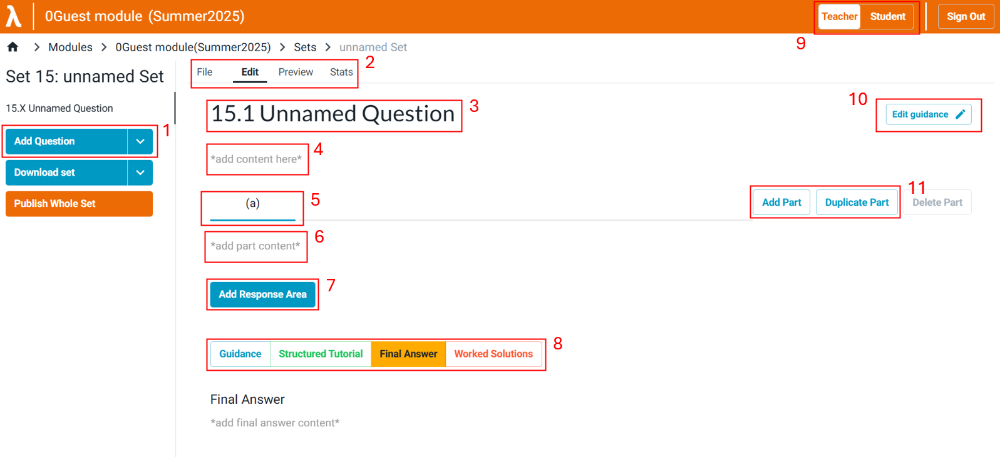

# Editing questions

This guide explains how to use the editor to create and modify [sets](https://lambda-feedback.github.io/user-documentation/terminology#sets) and [questions](https://lambda-feedback.github.io/user-documentation/terminology#questions).

## <ins>Click a Set</ins> to edit or add questions to it. 
   

## A guide to the editor:
   

| Label | Name | Description |
| :--- | :--- | :--- |
| **1** | **Add Question** | Add a new blank question, duplicate an existing question, or upload a .zip file containing one or more question JSON files. |
| **2** | **File, Preview, and Stats** | Access pages for: • **File:** Manage versions, download as a JSON file, or delete the question. • **Preview:** See the question as a student would. • **Stats:** View statistics on student responses for the question. |
| **3** | **Question Name** | Edit the name of the question. |
| **4** | **Master Content** | The main content for the question, which is always visible above the individual parts. This field uses the Milkdown editor. |
| **5** | **Current Part** | **Indicates** which question part you are currently editing. |
| **6** | **Part Content** | Edit the content for the selected question part (i.e., the sub-question). |
| **7** | **Response Area** | The input field where a student submits their answer. Adding a response area is optional. |
| **8** | **Question Help Options** | Add optional support materials for students, such as a [**Structured Tutorial**](https://lambda-feedback.github.io/user-documentation/terminology#structured-tutorial), a [**Final Answer**](https://lambda-feedback.github.io/user-documentation/terminology#final-answer), or [**Worked Solutions**](https://lambda-feedback.github.io/user-documentation/terminology#worked-solution). The buttons shown here are the same ones students will see. |
| **9** | **Teacher/Student View Toggle** | Toggle between the teacher editing view ('EDIT') and the student 'PREVIEW' to see how the question will appear to students. |
| **10** | **Edit Guidance** | Add extra details for the question, such as guidance notes, estimated completion time, and skill level. |
| **11** | **Part Options** | Add a new part, duplicate the current part, or delete a part (only available if there is more than one). |
