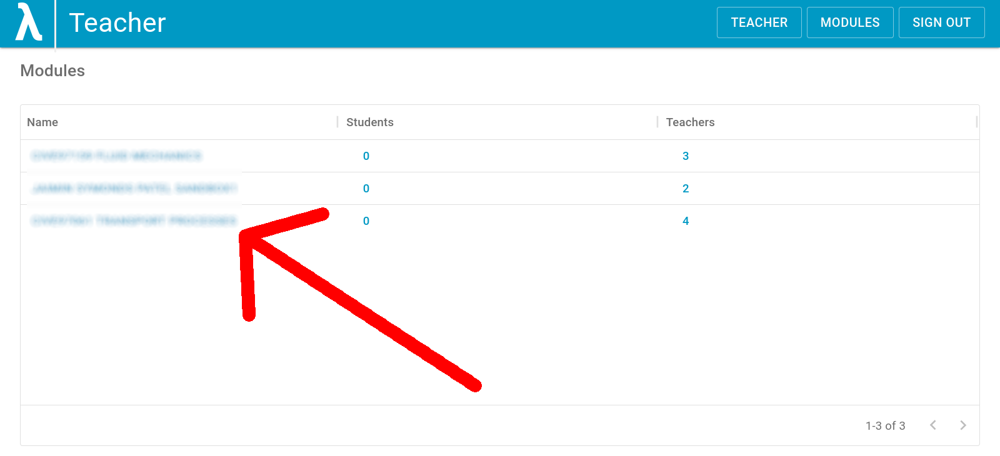
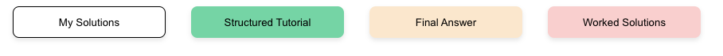

# Get started as a teacher

## Access a module

Use your Imperial Microsoft account to sign in and access your modules. By default you are logged in as a student. If you have teacher priviliges then you will see a teacher button at the top.

{: style="height:50px"} 
{: style="height:150px"}

To enter teacher mode, <ins>click on the Teacher button</ins>.

To find the module you want, you can sort ASCENDING as per the image below: 
{: style="height:200px"}
{: style="height:200px"} 
_Image: quick sort (left) or filtering (right)_

As of 31/8/22 the filtering/sorting only works on the content visible on the current page (other pages are ignored). We aim to fix this by sorting at the backend.

Select the module you wish to edit. 
{: style="height:150px"}

## Create a new problem set

<ins>Click on your module</ins> and then <ins>click on "view sets"</ins> (upper left-hand corner) 
{: style="height:50px"}

If necessary, create a new set - this will automatically appear with a default name which you can edit by clicking 'edit metadata': 
{: style="height:50px"}

To edit the content, <ins>click on the set</ins>. This will open the Set in a ['WYSIWYG'](https://en.wikipedia.org/wiki/WYSIWYG) editor. The first question is automatically created with a default name.

The question structure is described [here](../../student/index.md).

## Below the line

Below the main question content you can provide high quality support material for students. 

A [student guide is here](../../student/index.md) and teachers use the content as follows:

- 'My solutions' is a milkdown component for students to use to store their own solutions
- 'Structured tutorial' is a canvas to provide scaffolding to students struggling with the question
- 'Final answer' is self explanatory
- 'Worked solutions' provides detailed, step-by-step solutions.

All content below the line uses milkdown functionality. Worked solutions can be branched. Future developments will add branching and response areas to structured tutorials.
 
 
For general terminology, see [here.](../../intro/terminology.md)
