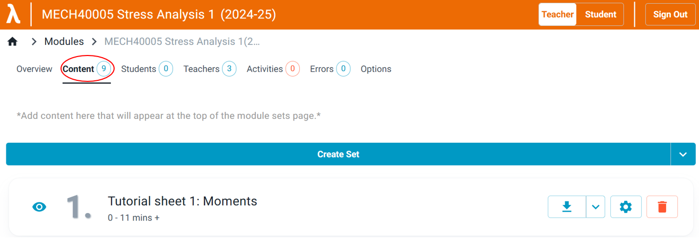
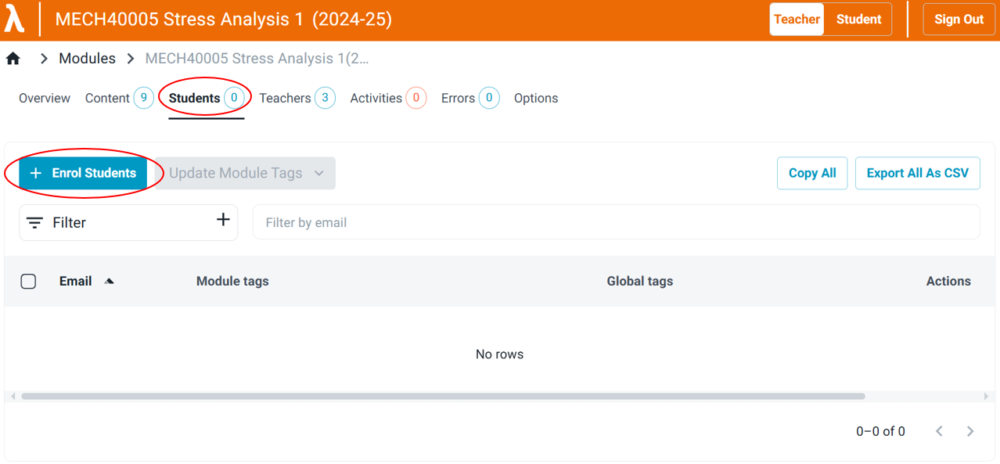

# Getting Started with Lambda Feedback for Teachers

## Access a Module

Use your Imperial Microsoft account to sign in and access your modules. By default, you are logged in as a student, and the interface will be blue. If you have teacher **privileges**, you will see a 'Teacher' button at the top.

 

To enter teacher mode, <ins>click the 'Teacher' button</ins>, and the **colour** of the interface will change to orange. This is where you can access all your modules, as well as upload and edit problem sets.

As of **July 2023**, new modules can only be added to Lambda Feedback by administrators. Please **contact an administrator** if you want your module added to the website.

 

To find the module you want, you can sort them in **ascending/descending order**, or filter them as shown below:
 
{: style="height:200px"}
{: style="height:200px"} 
_Image: Quick sort (left) or filtering (right)_

Select the module you wish to edit.
 

## Create a New Problem Set

<ins>Click your module</ins> and then <ins>click 'Content'</ins> (in the upper-left corner).
 

Create a new set by **clicking** the 'Create Set' button.

A menu will appear with options to edit the name, description, and other settings for the new set.

To edit the content, <ins>click the set name</ins>. This will open the set in a ['WYSIWYG'](https://en.wikipedia.org/wiki/WYSIWYG) editor. The first question is automatically created with a default name.

The question structure is described [here](../../student/index.md).

## Below the Line

Below the main question content, you can provide high-quality support material for students.

{: style="height:50px"}

A [student guide is here](../../student/index.md). Teachers use the 'below the line' content as follows:

-   **Structured tutorial** is to provide scaffolding for students struggling with the question.
-   **Final answer** is self-explanatory.
-   **Worked solutions** provides detailed, step-by-step solutions.

All content below the line uses Lexdown functionality. Worked solutions can be branched. Future developments will add branching and response areas to structured tutorials.

It is not necessary to include all three methods of help. If you only provide content for one tab, only that button will appear in the published student version.

For general terminology, see [here.](../../terminology.md)

To see further details on how to edit your questions, see [here.](content-sets-questions.md)

## Enrolling Students

In **Teacher mode**, open your module's home page, click the 'Students' tab, and then click 'Enrol Students'.

Enter a student's email address, or alternatively paste in a list of email addresses separated by commas.

Press 'Enter' to add the email addresses:

Then click 'SUBMIT' to enrol the students.

### Imperial College London Email Addresses

You must use the long-form email address:

#### Valid:

first.nameYY@imperial.ac.uk (student)
 
j.doe@imperial.ac.uk (staff)
 
first.name@imperial.ac.uk (staff)
 

#### Invalid:

abc123@ic.ac.uk
 
abc123@imperial.ac.uk
 
user@ic.ac.uk
 
user@imperial.ac.uk
 
first.nameYY@ic.ac.uk
 

This is because we use Azure Active Directory (i.e., Microsoft) to **authorise** users.
