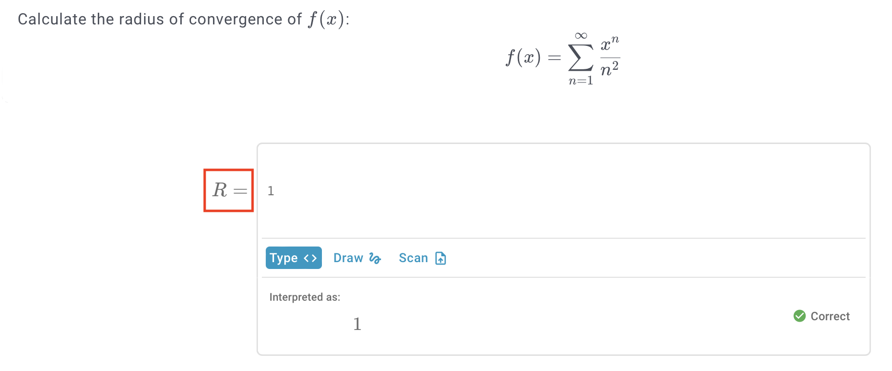
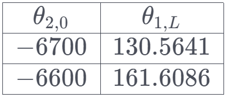
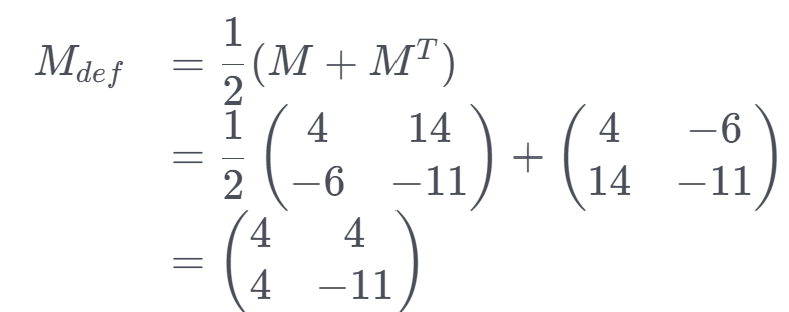

# Good practice

## Romanised operators

Use romanised operators such as $\sin$, $\frac{\mathrm{d}}{\mathrm{d}x}$ instead of $sin$, $\frac{d}{dx}$, etc.

## Use empty lines

Using empty lines can improve the readability and neatness of your content. Empty lines are often useful before and after an equation, and between paragraphs of text. An empty line in markdown requires _two spaces_ on the line, otherwise the line is ignored.

## Space between numbers and units

Put appropriate space between a number and its unit, such as `5 m` or `3 kg`, according to the SI conventions.

## Romanise units and check their case

Use romanised units such as $\text{m}$, $\text{kN}$ instead of $m$, $kN$. Ensure that the case of the unit is correct.

## Add tests to response areas

In a response area, press `configure` then `tests`.

Tests allow you to enter potential student responses, define whether they are correct or not, then run the evaluation function on those student responses. This allows you to quickly test whether or not the evaluation function works as expected.

## Save and publish as you go

Saving and publishing work regularly is recommended to prevent accidental data loss.

## Use branching when relevant

Branching is a feature for `worked solutions`. It allows you to have different solution pathways Usage examples:

- When a question can be solved via multiple different methods, branching can be used for each method.
- When a question has multiple parts, where each part involves substitution of different values, branching can be used for each part.


## Use pre-response area text to be clear what should be entered

Pre-response area text is found under `configure` - `INPUT` in the evaluation function.

You can use LaTeX in the pre-response area text.



## Use `\dfrac` for bigger fractions when needed.

Use `$\dfrac{numerator}{denominator}$` for bigger fractions when you need to display them more clearly or emphasize them. For example, `$\dfrac{3}{4}$` will produce a bigger fraction than `$\frac{3}{4}$`.
Alternatively, you can use `$\displaystyle$` at the start of an inline equation to render everything afterwards full-size (as in display maths mode), this is especially helpful for integrals.

## Use `\small` when smaller fonts or fractions are needed

Use `$\small{text}$` when you need to display smaller fonts or fractions in your LaTeX expressions. For example, `$\small{\frac{1}{2}}$` will produce a smaller fraction than `$\frac{1}{2}$`.

## Use audio clips

Just drag + drop an audio file into the milkdown editor.

## Issue with input symbols

For the `code` of input symbols in the response areas, the system cannot accept brackets (i.e `dot(x)` for $\dot{x}$) and response must be formatted in different ways (i.e `dot_x`). 

`a_b` will render as $a_b$ without adding an input symbol, but note that `dot_x` overrides the `_` input (in this example, will render as $\dot{x}$ instead of $dot_x$)

## Use live preview and permit all types of input

Live preview and input types are found in an evaluation function under `configure` - `INPUT`.

Live preview instantly renders a student's input. This is very useful for long/complicated equations, as it allows students to ensure their input is correct.


## Latex help

1. Use `\begin{array}` to generate a compact table i.e.  
    
    ```latex
    \begin{array}{|c|c|}
    \hline
    \theta_{2,0} & \theta_{1,L}\\
    \hline
    -6700 & 130.5641\\
    \hline
    -6600 & 161.6086\\
    \hline
    \end{array}
    ```

    

2. Use `\begin{aligned}` to keep your working formatted nicely

    ```latex
    \begin{aligned}
    M_{d e f} &=\dfrac{1}{2}(M+M^T)\\
    & =\dfrac{1}{2} \begin{pmatrix} 4 & 14\\ -6 & -11 \end{pmatrix}+\begin{pmatrix} 4 & -6\\ 14 & -11 \end{pmatrix}\\
    & =\begin{pmatrix} 4 & 4\\ 4 & -11 \end{pmatrix}
    \end{aligned}
    ```

    

3. Use `\left` and `\right` for equations with multiple brackets

    ```latex
    f(x)=\left (\frac{(\cos (x) -x) + i(\sin (x) - x)}{wi} \right)
    ```

    

    This also works for `[ ]` and `\{ \}`

4. Use `\sin`, `\cos`, etc. as a shortcut for `\text{sin }`, `\text{cos }`, etc.
