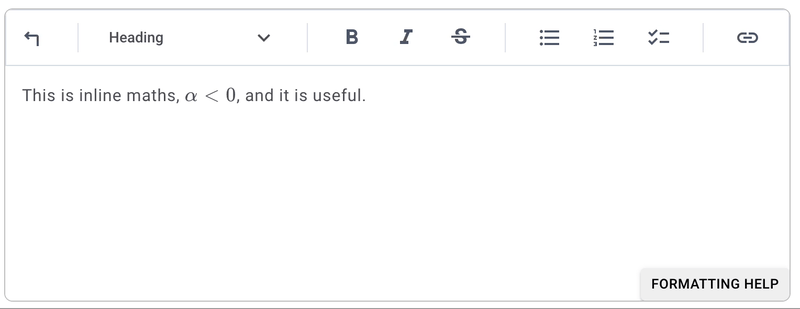
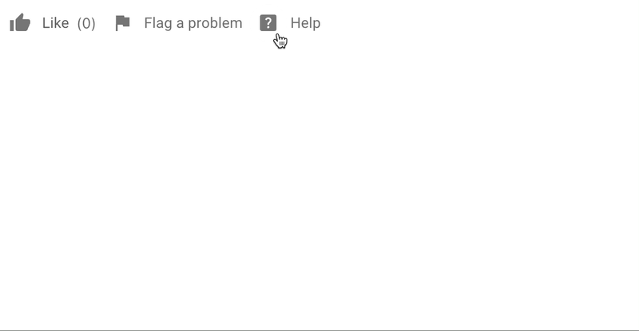
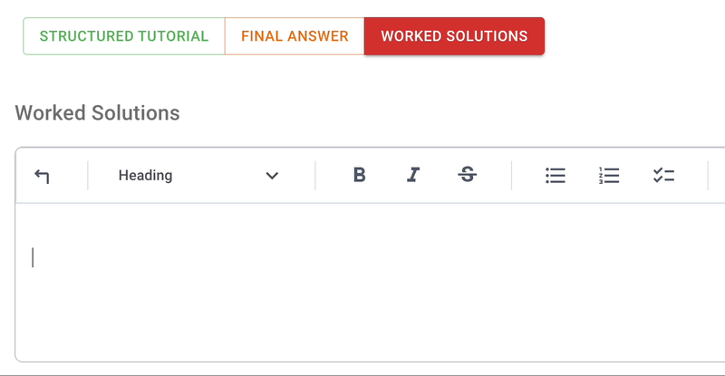

# The lexdown editor

The lexdown is widely used in Lambda Feedback. It accepts:

- standard [markdown](https://www.markdownguide.org/basic-syntax/)
- [$\LaTeX$](https://www.overleaf.com/learn/latex/Learn_LaTeX_in_30_minutes) (delimited by $ and limited to [KaTeX](https://www.katex.org) functionality)
- images (paste or drag and drop)
- videos (paste a URL)

The lexdown editor is an adapted version of lexical to use markdown-first, and incorporate features including drag-and-drop images, embedded videos and autio, and switch to raw markdown.

## Common needs in milkdown

Here's a walkthrough to create some basic content:

### Inline maths

Use the `$` sign to delimited inline maths. For example type the following:

`This is inline maths, $\alpha<0$, and it is useful`

### Equation mode

Start a blank line with `$$` then press the space bar. This will introduce an equation editor. Type raw $\LaTeX$ into the shaded part and see the live preview in the lower part. \*Press `ctrl+enter` (Mac: `cmd+enter`) to exit the equation editing box.

For example, type the following after typing `$$ [space]` into a fresh line:

`f(x) = \int_{-\infty}^\infty \hat{f}(\xi)\,e^{2 \pi i \xi x} \,\mathrm{d}\xi`

### Steps in worked solutions

If you begin a fresh line with `---` (three dashes) then a horizontal rule appears. Alternatively click the button on the toolbar to insert a horizontal rule.

If you are editing a worked solution, then Lambda Feedback will split the worked solution into steps according to the location of horizontal rules. You can delete and add the rules and the solution steps will update.

For example:

`This is the first step of the solution - which is a good hint towards solving` 
`--- ` 
`This is a second step, which makes it more obvious` 
`---` 
`Finally we reach the solution`

When viewing the worked solutions, this is how it looks:

This is the process to create the solution steps:

### Images

You can add images with drag-and-drop or copy-and-paste. Images can be resized with the mouse, or click on the image to configure, or edit the raw markdown.

### Empty lines

Use 'Enter' for a new paragraph, or 'shift-Enter' for a line break.
