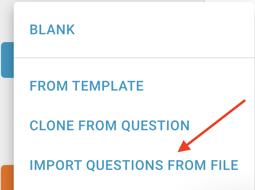
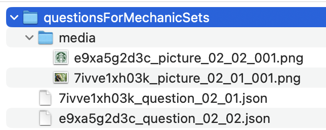

# Question export and import

## Export a question

Under the File menu, select the Export as JSON option:

The question and images (if any) will be downloaded into your download folder.

## Import a question

Click Add question menu and select Import questions from file option:

The file explorer opens. Select the zip file containing the question and click open. The question will be added as the last question.

The zip file must contain question data in a valid JSON format. The best way to obtain a valid JSON format is to export a question, unzip the download file and open the JSON file. If the question contains media, they must be in the media folder inside of the zip file.

## Import more than 1 question

The zip file can contain more than one question. Each of the questions must be in the JSON file and in the correct format. All media must be in the media folder.

It is possible to e.g. export 2 questions, then unzip the exported zip files and then zip both questions and their medias into one zip file and then import the one zip file. Here is an example of a folder containing 2 questions and their medias:

The name of the folder and names of json files are not important. However, the name of media files must correspond with the names used in the json files when referring the media.
