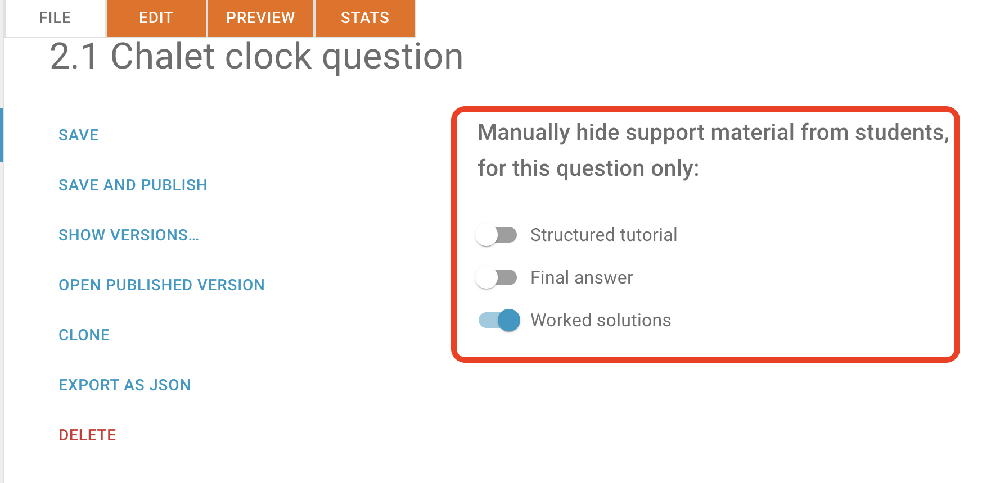
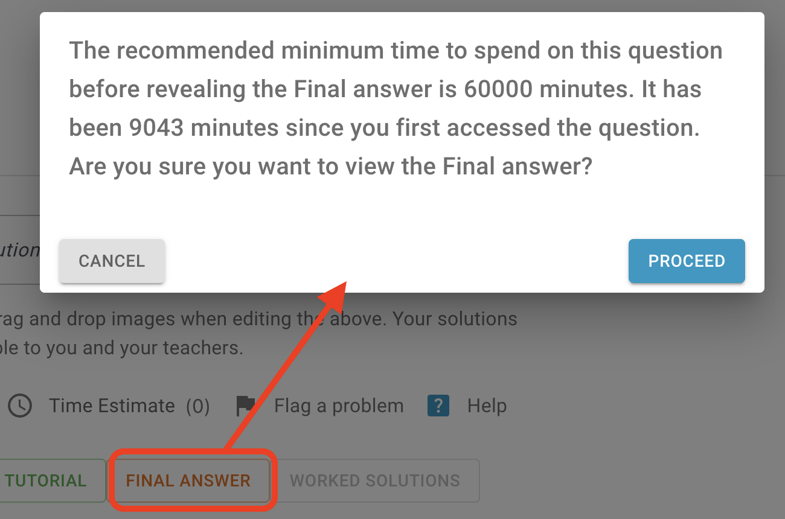

# Support material access configuration

Students can use the following types of support materials to help them to answer the question:

- Sructured tutorial
- Final answer
- Worked solutions

## Configuring student access

It is possible to configure the student access to the support material at the set level and also at the question level.

### Configuring student access at the set level

Open the Edit Set Metadata page by clicking on the Edit Set Metadata button in the list of sets:

The page contains the Student access to support material section:

Access to each support material type can be set to one of the following options:

#### Open

Students can open this support material type without any restrictions. 

This is valid for all questions in the set except those for which the support material access is set to be hidden at the question level (see below).

#### Open with warnings

A warning window appears if the studen opens the content before the recommended time.

The recommended time is the Minimum time estimate (mins) which can be set on the question Guidance page:

{ width="400" }

However, the option will be changed to **Open**, if any of the following is true:

- The student has downloaded the PDF 
- There is no minimum time estimate set for the question
- The time now minus the time the student first accessed the question is more than the minimum time estimate

This is valid for all questions in the set except those for which the support material access is set to be hidden at the question level (see below).

#### Hidden

Students cannot open any support material for any question in the set.

This is valid for all questions in the set, even those for which the support material access is set to Open at the question level (see below).

### Configuring student access at the question level

The support material access configuration at the question level is located on the  File tab:

All support material is open by default, it can be changed:

- If the switch is **off**, then the support material is **open**
- If the switch is **on**, then the support material is **hidden**

## Summary overview

| Set level setting  | Question level setting | Result (using Final answer as an example) | Description                      |Comment                          |
| ------------------ | ---------------------- | ----------------------------------------- | -------------------------------- |-------------------------------- |
| Hidden             | N/A                    | { width="200" } | The Final answer is disabled | The setting at the question level is ignored |
| Open               | Hidden                 | { width="200" } | The Final answer is disabled | |
| Open with warnings | Hidden                 | { width="200" } | The Final answer is disabled | The same result as above |
| Open with warnings | Open                   | { width="200" } | When the Final answer is clicked, a warning message appears | Additional conditions must be met:   <li>PDF not downloaded</li> <li>The minimum time estimate is set for the question</li>  <li>The time now minus the time the student first accessed the question is more than the minimum time estimate</li> If any of them is not met, then the support material will be open with no warnings. |