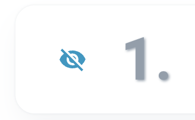
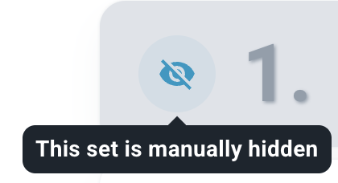
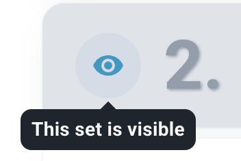
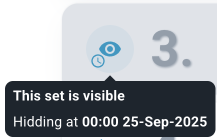
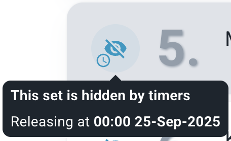
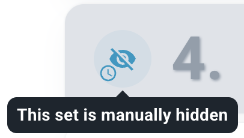
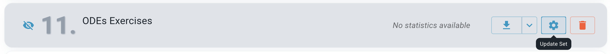
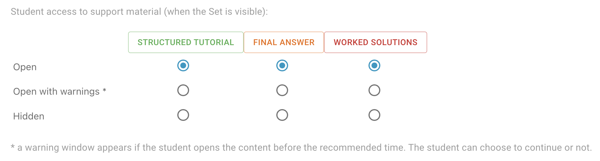
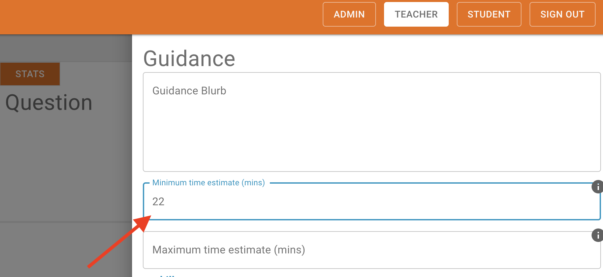
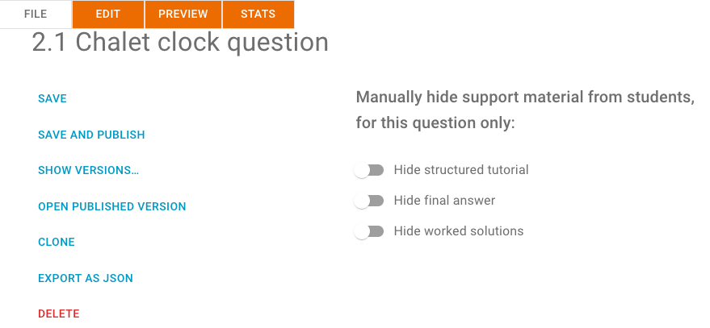

# Content structure

## Modules

Modules are the fundamental unit of content management in Lambda Feedback (not, for example, cohorts, or years/terms/semesters)

## Instances of a module (e.g. '2026/27')

Instances of a module are independentent but share the same umbrella title to help organise content. A module with multiple instances will have a drop-down menu in the title bar where users can switch modules. If you do not see the drop-down then you do not have access to other instances (or there are no other instances).

### Default instance when there are multiple

When opening a module in Lambda Feedback the default instance opens. The default is defined based on start and end dates for the instances. There are obvious cases such is if there is only one instance, or only one instance that is open and not closed. Logic for other cases is as follows:

| Case | Default instance|
|---|---|
|All instances closed in past|Most recent start date|
|All instances not started yet|Latest start date*|
|Multiple instances open|Latest start date|

\* This logic seems incorrect, but as of 10/7/25 it was the behaviour of the system

The UX is based around the default being the most common need. In the rare case that access to a different instance is required, navigation is available.

Note that students rarely access multiple instances of a module; teachers rarely access previous/closed instances of a module. 

### Data continuity between instances

Instances are independent. New instances are created without students enrolled, submissions or events recorded, or comments. Student and teacher enrollments are independent between different instances.

## Teacher roles

There are multiple Teacher roles, which are allocated per module instance. Admins manage the list of teacher roles available within a tenant. Each teacher role has a customised combination of privileges. One role always exists, which is 'Module Owner', which includes all privileges. 

## Enrolment

Access for students or teachers is controlled by enrollment, which is detailed in the [getting started](../guides/gettingstarted.md#enrolling-students) guide. 

## Set visibility

### Rules

Visibility to students is governed by the 'Manually hidden' toggle, AND the opening times.

Manually hidden (TRUE): regardless of timings, the Set will not be visible to students.

Manually hidden (FALSE): the Set visibility to student depends on the opening and closing settings

Opening time: 
- before this time, the Set is not visible to students
- after this time, or if this time is blank, the Set is visible to students if 'Manually hidden' is FALSE. 

Closing time:
- after this time, the Set is not visible to students
- before this time, or if this time is blank, the Set is visible to students if 'Manually hidden' is FALSE. 

### Editing Set visibility

In TEACHER mode, users with Edit permissions can modify the visibility of a Set:

Visibility can be edited within the 'Content' tab. Each set has an icon on the left hand side indicating the current visibility. Clicking on the icon opens a modal to edit and save the visibility: 

{width=150px}

Alternatively, clicking on the 'Settings' icon will open a broader list of options, including the visibility settings.

Examples of the icon indicating visibility are below, with the mouse hover:

{width=150px}
{width=120px}

{width=130px}
{width=135px}
{width=150px}

## Question visibility

When a Set is visible, all pages within that Set can be accessed by a student user. 

However, the visibility of 'support material' (such as worked solutions) can be controlled.

## Support material visibility

The following types of support materials are available to students in the `help` section:

- Structured tutorial
- Final answer
- Worked solutions

Two methods can be used to hide support material:

### Configuring student access at the Set level

Click Update Set:

The page contains the Student access to support material section:

Access to each support material type can be set to one of the following options:

#### Available

Students can open this support material type without any restrictions.

This is valid for all questions in the set except those for which the support material access is set to be unavailable at the question level (see below).

#### Available with warnings

A warning window appears if the student opens the content before the recommended time.

The recommended time is the Minimum time estimate (mins) which can be set on the question Guidance page:

{ width="400" }

However, the option will be changed to **Available**, if any of the following is true:

- The student has downloaded the PDF
- The part is marked as done
- There is no minimum time estimate set for the question
- The time now minus the time the student first accessed the question is more than the minimum time estimate (the student has accessed the question for longer than the minimum time estimate)

This is valid for all questions in the set except those for which the support material access is set to be unavailable at the question level (see below).

#### Unavailable

Students cannot open any support material for any question in the set.

This is valid for all questions in the set, even those for which the support material access is set to Available at the question level (see below).

### Configuring student access at the question level

The support material access configuration at the question level is located on the File tab:

All support material is available by default, it can be changed:

- If the switch is **off**, then the support material is **available**
- If the switch is **on**, then the support material is **unavailable**

## Summary overview

| Set level setting  | Question level setting | Result (using Final answer as an example)             | Description                                                                                  | Comment                                                                                                                                                                                                                                                                                                                                   |
| ------------------ | ---------------------- | -------------------------------------------------------------------------------------- | -------------------------------------------------------------------------------------------- | ----------------------------------------------------------------------------------------------------------------------------------------------------------------------------------------------------------------------------------------------------------------------------------------------------------------------------------------- |
| Unavailable             | N/A                    | { width="200" }  | The Final answer is disabled                                | The setting at the question level is ignored                                                                                                                                                                                                                                                                                              |
| Available               | Unavailable                 | { width="200" } | The Final answer is disabled                                |                                                                                                                                                                                                                                                                                                                                           |
| Available with warnings | Unavailable                 | { width="200" } | The Final answer is disabled                                | The same result as above                                                                                                                                                                                                                                                                                                                  |
| Available with warnings | Available                   | { width="200" }    | When the Final answer is clicked, a warning message appears | Additional conditions must be met:   <li>PDF not downloaded</li> <li>Part not marked as done</li><li>The minimum time estimate is set for the question</li> <li>The time now minus the time the student first accessed the question is more than the minimum time estimate</li> If any of them is not met, then the support material will be available with no warnings. |
