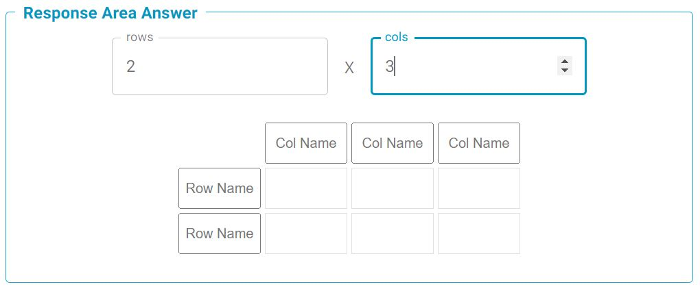

# Table

Table response area. Will populate the component with a grid of text input fields, in order to facilitate inputing elements of a table. The number of rows and columns can be specified, along with their corresponding names.

## Evaluation Function Options

### ArrayEqual
Evaluation function checks if the supplied response and answer arrays are within the optionally supplied tolerances. This is based on the [numpy.allclose](https://numpy.org/doc/stable/reference/generated/numpy.allclose.html) function. Numpy is a dependancy for this function, but it means that arrays of any shape (regular) can be compared efficiently.

### ArraySymbolicEqual
Very similar to the SymbolicEqual grading function, but grading any list of expressions instead. This algorithm can take any level of nesting for "response" and "answer" fields, as grading is done recursively (as long as both shapes are identical). Symbolic grading is done using the SymPy library. See [SymPy](https://www.sympy.org/en/index.html.md-button) for further information.

## Component Parameters 

### `rows` 
The number of rows required for the table can be entered into this input field, either through typing directly, or using thr up and down arrows located inside the box.

### `cols` 
The number of columns required for the table can be entered into this input field, either through typing directly, or using thr up and down arrows located inside the box.

### `post_response_text` (optional)
Text block to be displayed to the left of the input field. Markdown and LaTeX are allowed following the usual syntax.

### `pre_response_text` (optional)
Text block to be displayed to the left of the input field. Markdown and LaTeX are allowed following the usual syntax.

## Setting The Answer

Once the required number of rows and cols has been inputted, The names of each row and column should be changed depending on their corresponding variables. The value of each grid element can then be entered into individual input fields. 

If the row or column names are not changed, these will appear blank in the student response area.

## Example Student Response

Correct response:

Incorrect response:

