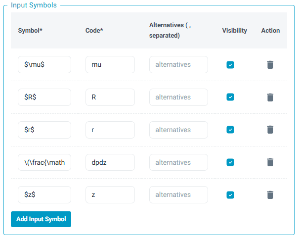
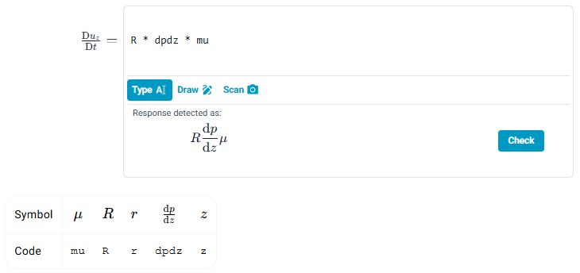

# Expression

This response area is very similar to [Text](Text.md), differing in that it can display how the user's response was interpreted back to them through the 'live preview' feature. This works using the grading function, providing a `feedback.response_latex` field, which gets rendered.

## Evaluation Function Options

### `isSimilar`

Calculates the difference between the teacher answer (ans) and the student response (res); compares this to an allowable difference comprising an absolute tolerance (atol) and a relative tolerance (rtol).

### `symbolicEqual`

Compares two symbolic expressions for mathematical equivalence, using SymPy. See [SymPy](https://www.sympy.org/en/index.html.md-button) for further information.

## compareExpressions
**Input Symbols**

This is a powerful feature for defining a dictionary of accepted symbols. For each symbol, you define:
*   **Symbol:** The LaTeX-rendered symbol (e.g., `$f(x)$`).
*   **Code:** The machine-readable variable name (e.g., `fx`). This is what your students will type and what the evaluation function sees.
*   **Alternatives:** A list of other codes you want to accept for the same symbol (e.g., `f_x`, `f(x)`, `f`). This allows you to anticipate different ways students might type the same thing.
*   **Visibility:** A `TRUE`/`FALSE` toggle. If "Display input symbols" is enabled in the Input tab, this setting determines whether a specific symbol is shown to the student. This allows you to show students common symbols while still accepting less common or alternative ones in the background.

Tolerances can also be added. These will apply to the numerical parts of the answer (e.g. the $10$ in $10x$).

This is done using the `atol` and `rtol` fields under the Evaluation Function Parameters section.

## Component Parameters

### `post_response_text` (optional)

Text block to be displayed to the left of the input field. Markdown and LaTeX are allowed following the usual syntax.

### `pre_response_text` (optional)

Text block to be displayed to the left of the input field. Markdown and LaTeX are allowed following the usual syntax.

### Enable Handwriting Input

Enables a handwriting canvas in the browser, which allows a student to draw their expression, rather than type using Sympy's syntax.

### Enable Photo Upload

Allows a student to upload their expression as an image, as an alternative to handwriting if the student isn't using a phone or tablet.

## Setting The Answer

Type the correct answer into the 'Response Area Answer' using standard syntax. As the student enters the answer, this will be rendered using the 'live preview' feature, to ensure the correct expression has been entered.

Use the 'Response Area Preview' to check the answer has been set correctly.

## Example Student Response area

Correct response given

Incorrect response given

