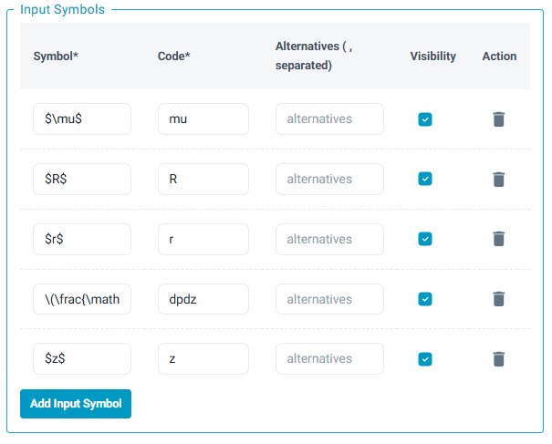
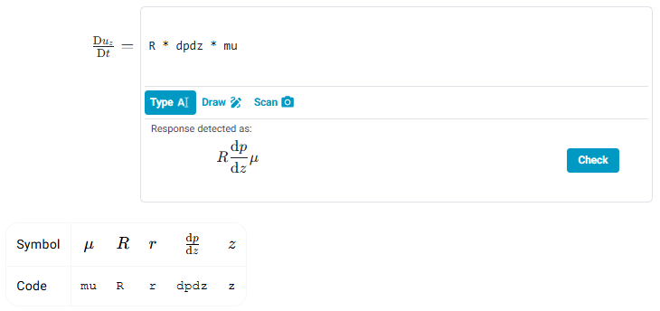

# Math_Single_Line

This response area is very similar to [Text](Text.md), differing in that it can display how the user's response was interpreted back to them through the 'live preview' feature. This works using the grading function, providing a `feedback.response_latex` field, which gets rendered.

## compareExpressions
**Input Symbols**

This is a powerful feature for defining a dictionary of accepted symbols. For each symbol, you define:

*   **Symbol:** The LaTeX-rendered symbol (e.g., `$f(x)$`).
*   **Code:** The machine-readable variable name (e.g., `fx`). This is what your students will type and what the evaluation function sees.
*   **Alternatives:** A list of other codes you want to accept for the same symbol (e.g., `f_x`, `f(x)`, `f`). This allows you to anticipate different ways students might type the same thing.
*   **Visibility:** A `TRUE`/`FALSE` toggle. If "Display input symbols" is enabled in the Input tab, this setting determines whether a specific symbol is shown to the student. This allows you to show students common symbols while still accepting less common or alternative ones in the background.

Tolerances can also be added. These will apply to the numerical parts of the answer (e.g. the $10$ in $10x$).

This is done using the `atol` and `rtol` fields under the Evaluation Function Parameters section.

## Component Parameters

### `post_response_text` (optional)

Text block to be displayed to the left of the input field. Markdown and LaTeX are allowed following the usual syntax.

### `pre_response_text` (optional)

Text block to be displayed to the left of the input field. Markdown and LaTeX are allowed following the usual syntax.

### Enable Handwriting Input

Enables a handwriting canvas in the browser, which allows a student to draw their expression, rather than type using Sympy's syntax.

### Enable Photo Upload

Allows a student to upload their expression as an image, as an alternative to handwriting if the student isn't using a phone or tablet.

### Handwriting and Image Handling
Handwriting and students photo uploads are handled with [MathPix](https://docs.mathpix.com/#request-parameters). 

Our default parameters include:
- **formats**: `['text']` - Returns Mathpix Markdown text with math inside delimiters
- **include_line_data**: `true` - Adds line-by-line data with geometric information about detected elements
- **rm_spaces**: `true` - Omits spaces around LaTeX groups and other places where spaces are superfluous
- **rm_fonts**: `true` - Omits `mathbb`, `mathbf`, `mathcal`, and `mathrm` font commands
- **idiomatic_braces**: `true` - Returns more compact LaTeX (e.g., `x^2` instead of `x^{2}`)
- **numbers_default_to_math**: `false` - Standalone numbers are treated as text, not automatically wrapped in math mode
- **math_fonts_default_to_math**: `false` - Text with math fonts is not automatically converted to math mode
- **math_inline_delimiters**: `['$', '$']` - Delimiters for inline math mode in text output
- **math_display_delimiters**: `['$$', '$$']` - Delimiters for display/block math mode in text output
