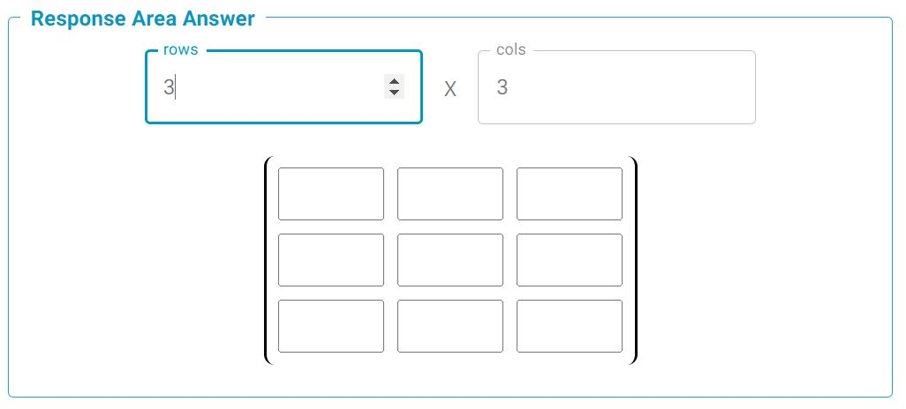
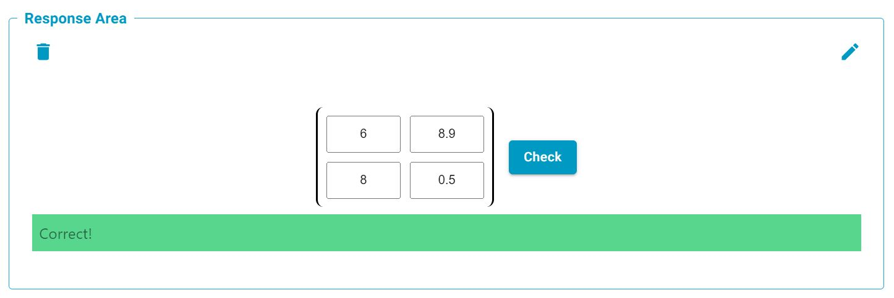

# Matrix

Matrix response area. Will populate the component with a grid of text input fields, in order to facilitate inputing matrices.

## Evaluation Function Options

### ArrayEqual
Evaluation function checks if the supplied response and answer arrays are within the optionally supplied tolerances. This is based on the [numpy.allclose](https://numpy.org/doc/stable/reference/generated/numpy.allclose.html) function. Numpy is a dependancy for this function, but it means that arrays of any shape (regular) can be compared efficiently.

### ArraySymbolicEqual
Very similar to the SymbolicEqual grading function, but grading any list of expressions instead. This algorithm can take any level of nesting for "response" and "answer" fields, as grading is done recursively (as long as both shapes are identical). Symbolic grading is done using the SymPy library. See [SymPy](https://www.sympy.org/en/index.html.md-button) for further information.

## Component Parameters 
### `rows and cols` (required)
Required paramter, describes the shape of the Matrix to be displayed. 

In the 'Response area answer' section, the number of rows and columns can either be typed directly into the corresponding boxes, or adjusted using the up and down arrows, which appear once the mouse hovers over the input box.

### `post_response_text` (optional)
Text block to be displayed to the left of the input field. Markdown and LaTeX are allowed following the usual syntax.

### `pre_response_text` (optional)
Text block to be displayed to the left of the input field. Markdown and LaTeX are allowed following the usual syntax.

## Setting The Answer
Once the required number of rows and cols has been selected, Each element of the matrix can be entered by clicking the individual input boxes and typing in the correct numbers.

## Example Student Response
Correct response given

Incorrect response given
