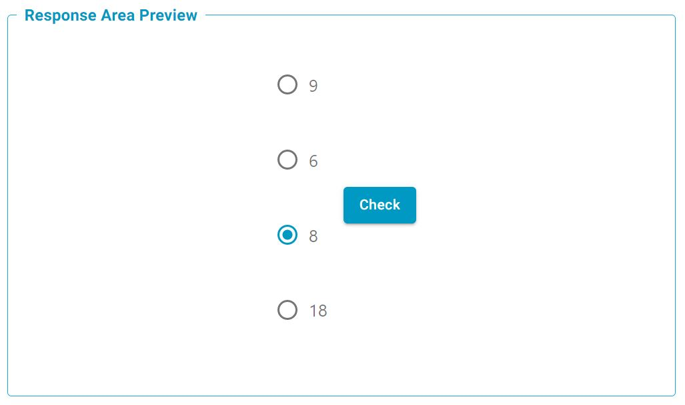

# MultipleChoice

General multiple choice response area. Features multiple options for single answer and randomising the order.

## Evaluation Function Options

### ArrayEqual
Evaluation function checks if the supplied response and answer arrays are within the optionally supplied tolerances. This is based on the [numpy.allclose](https://numpy.org/doc/stable/reference/generated/numpy.allclose.html) function. Numpy is a dependancy for this function, but it means that arrays of any shape (regular) can be compared efficiently.

## Parameters 
### `options` (required)
This is an array containing strings, each representing an option in the multiple choice component. These are parsed using the `parseEquations` function, meaning they can support markdown styling and LaTeX. 

!!! example 

    ```json
    "options": [
      "\\( 4x^2 + 2 = \\frac{\\delta y}{\\delta x} \\)",
      "\\( \\pi = 3 \\)",
      "\\( K_{iakb} U^{b}_{k} = f^{a}_{i} \\)",
      "\\( 3 = \\pi \\)",
    ]
    ```

### `Randomise` (optional)
This is an optional boolean which will shuffle the options array on each render of this component. 

switch to 'randomise'


### `singleAnswer` (optional)
By default, each item options is rendered using the html `checkbox` input type. Setting the `singleAnswer` boolean flag will turn those into `radio` buttons, allowing the student to select only one option at a time.


**Note** Changing this flag will alter the shape of the [Response Structure](#response-structure), and potentially require changing the grading function type and settings.


## Response Structure
*This is how the react component will structure the user's input to the Grading Gateway, when they press the check button.* 

This structure is different depending on if the `singleAnswer` option was used:

### `singleAnswer` == False (or undefined)

In this case, the user data is saved as an array with the same length as `options`, where each item is either a `1` or a `0` depending on if the corresponding option was selected.

!!! example

    If for an instance where there are 4 options, and the first and third options were selected, the response field would be:

    ```json
    "response": [1, 0, 1, 0]
    ``` 


Example Screenshot: SingleAnswer = False 


### `singleAnswer` == True 

In this case, there is only one correct answer, and each option is displayed as a radio button. Therefore the response field contains only one integer, corresponding to the index of the selected option. 

!!! example

    If for an instance where there are 4 options, and the third option was selected, the response field would be:

    ```json
    "response": 2
    ``` 

Example Screenshot: SingleAnswer = True 



## Example Student Response

*This shows a response where `singleAnswer` was set to False, since each option is displayed as a `checkbox`*