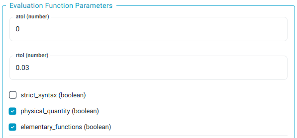

# NumericUnits

Provides two input fields with `Number` and `Units` placeholder texts. This area will also display its associated grading function (as seen in the screenshot below). 

**Note:** this area will display how the user's response was interpred using the `interp_string` field provided in the feedback object returned by that function (if it exists).

## Component Parameters 
### `pre_response_text` & `post_response_text` (optional)
Text block to be displayed to the left and right of the input field respectively. Markdown and LaTeX are allowed following the usual syntax.

### Comparing units
This is done using the **compareExpressions** evaluation function.

By ticking the `physical_quantity (boolean)` option in the *Evaluate* tab, answers with different units from the reference answer can be compared.



For example, if the reference answer is 100 m, the following answers will also be accepted:

*   0.1 km
*   10000 cm
*   10^5 mm

See [here](https://lambda-feedback.github.io/user-documentation/user_eval_function_docs/compareExpressions/#4-checking-the-value-of-an-expression-or-a-physical-quantity) for more information
### Tolerances
This is done using the **compareExpressions** evaluation function.

Tolerances can be added to your answer using the `atol (number)` and `rtol (number)` fields, which denote absolute and relative tolerances respectively.

## Response Structure
*This is how the react component will structure the user's input to the Grading Gateway, when they press the check button.* 

In this case, the response is a single string which features the user's response to both fields separated by a space.

!!! example 

    ```json 
    "response": "150 g"
    ```

## Example Screenshot 

