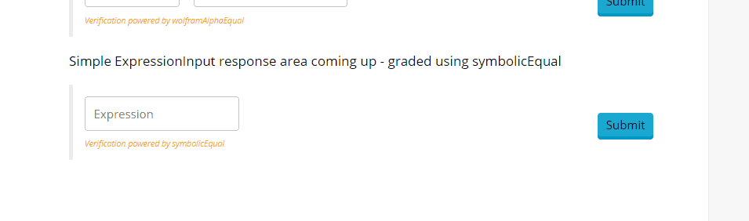

# Response Area Components

These are what the user interacts with on the front-end. As React components, they admit a certain number of parameters which are described in this section. Their basic operation is shown in the following gifs

## [ExpressionInput](ExpressionInput.md) Response Component, with [symbolicEqual](../grading_functions/symbolicEqual.md) grading function

## [NumericUnits](NumericUnits.md) Response Component, with [wolframAlphaEqual](../grading_functions/wolframAlphaEqual.md) grading function
